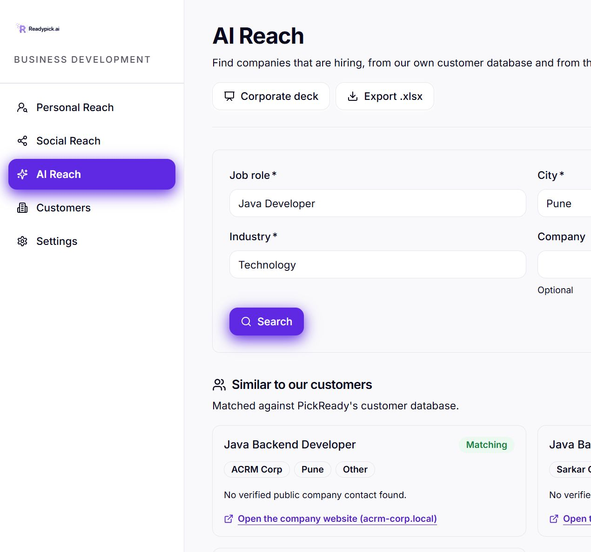
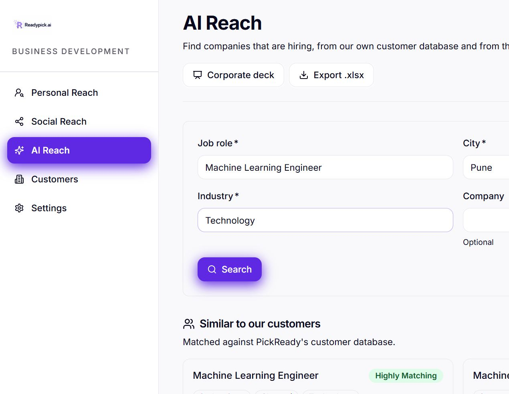
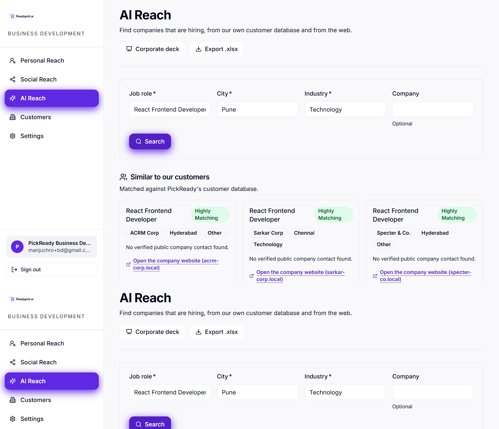
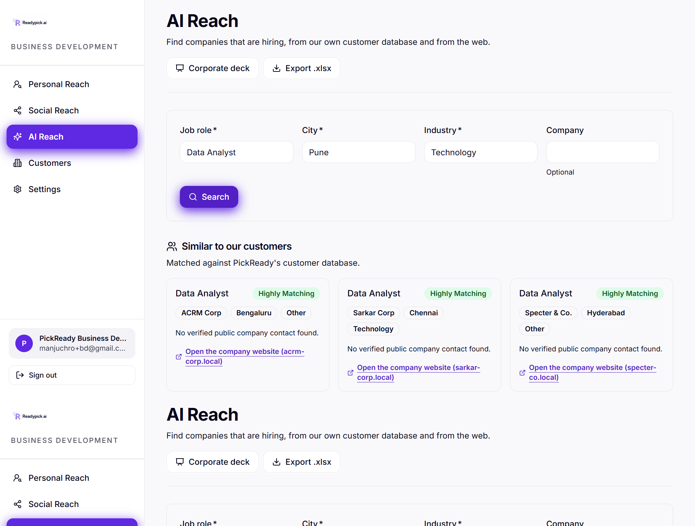
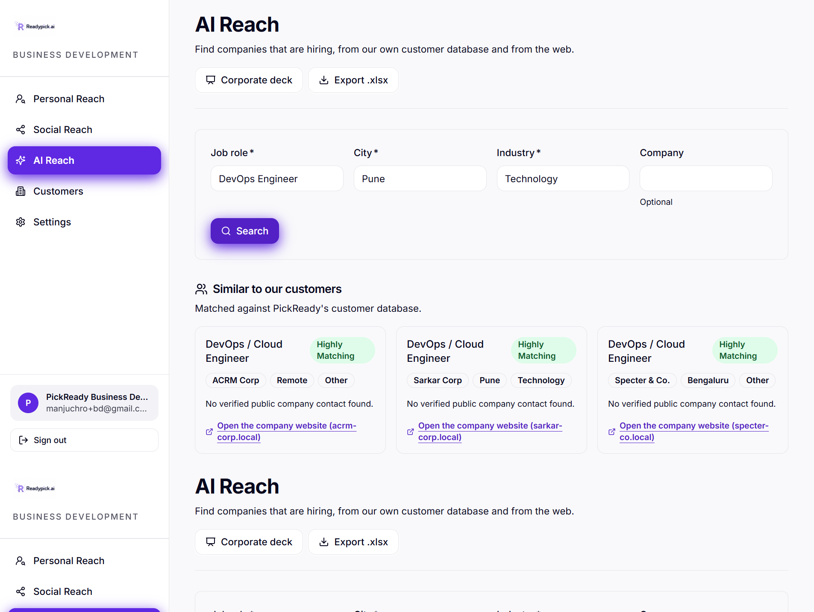

# Change 7 verification — AI Reach semantic matching and shared web breaker

Verified on 2026-08-07.

## Release

- Commit: `824da9a8f83d8282a09750eb9841b104867c0732`
- Pipeline: [GitHub Actions run 31176049005](https://github.com/HanuLisa-Technologies-LLP/pickready/actions/runs/31176049005)
- Pipeline result: all three blocking jobs passed:
  - Backend tests and agent evaluation
  - Build, migrate and stage
  - Promote to production
- Staged revisions (0% traffic during smoke testing):
  - Backend: `pickready-backend-00106-juf`
  - Frontend: `pickready-frontend-00101-yaq`
  - Worker: `pickready-worker-00037-vz7`
  - Beat: `pickready-beat-00037-rz2`
- Production promotion:
  - Backend `pickready-backend-00106-juf`: 100%
  - Frontend `pickready-frontend-00101-yaq`: 100%
  - Staging tags removed after promotion.
- Both staged and production smoke suites passed `/health`, authenticated dashboard/jobs routes, the API route contract, and the frontend root.

## Implementation verified

- Added `jobs.reach_embedding vector(384)`, an HNSW index, and invalidation triggers for job title, job-description, and competency changes in Alembic revision `0042_ai_reach_embeddings`.
- Uses the CPU-local `BAAI/bge-small-en-v1.5` FastEmbed model. The production image bakes the model into `/opt/fastembed-cache`; an offline container run with networking disabled produced a 384-dimensional embedding.
- Internal results are thresholded at `0.82` and ranked by `0.8 * semantic similarity + 0.2 * distinctive lexical similarity`. Results below the threshold are not padded.
- UI/API ratings are restricted to `Highly Matching`, `Matching`, `Moderately Matching`, and `Not Matching`.
- Web-search circuit-breaker state is shared in Redis, automatically expires after five minutes, and has an audited manual reset endpoint. Empty successful searches do not count as failures. The API distinguishes `breaker_open`, `quota_exhausted`, `timeout`, and `unavailable`.
- Tavily is configured in the production backend. No external embedding endpoint is required.

## Automated and integration evidence

- Backend: 1,263 tests passed against the real Compose PostgreSQL/Redis services.
- Focused host suite: 69 tests passed, including real model embeddings for all five acceptance roles, breaker behavior, and database health.
- Frontend: 12 tests passed, followed by ESLint and a successful Next.js production build.
- Offline agent evaluation: all cases passed; lowest score `1.00`.
- Alembic revision `0042_ai_reach_embeddings` applied successfully to PostgreSQL with pgvector.
- `jobs` and `job_competencies` retain both enabled and forced RLS.
- Real-database rollback probes confirmed that both title changes and competency changes invalidate the stored embedding.
- Real-Redis probe confirmed breaker open state with TTL 300, audited manual reset, and closed state after reset.
- Production-image service probes returned exactly the expected three customer tenants for Java, Machine Learning, React, Data Analyst, and DevOps.

## Live production UI evidence

The isolated in-app browser was authenticated as the seeded BD verification identity using short-lived, secure, HTTP-only test cookies. The browser session was closed after capture.

| Query | Live internal result |
|---|---|
| Java Backend Developer | Java Backend Developer at ACRM, Sarkar, and Specter; all `Matching` |
| Machine Learning Engineer | Machine Learning Engineer at ACRM, Sarkar, and Specter; all `Highly Matching` |
| React Frontend Developer | React Frontend Developer at ACRM, Sarkar, and Specter; all `Highly Matching` |
| Data Analyst | Data Analyst at ACRM, Sarkar, and Specter; all `Highly Matching` |
| DevOps Engineer | DevOps / Cloud Engineer at ACRM, Sarkar, and Specter; all `Highly Matching` |

The Java web search returned verified Mastercard and Xform listings, and the React search returned a verified Luxoft listing. Other provider attempts displayed the explicit temporary-unavailable state; no fabricated or padded web result was rendered.

### Screenshots

