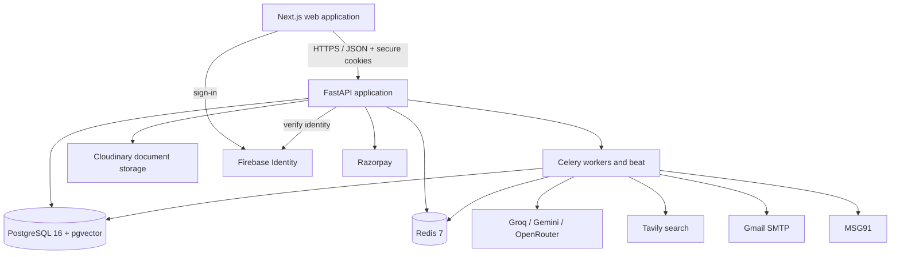
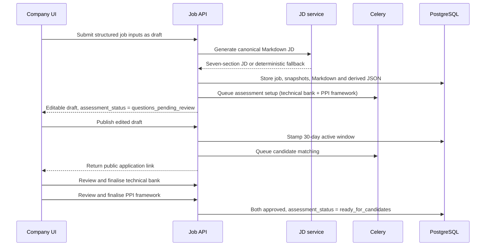
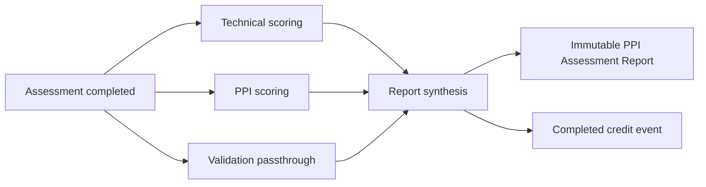
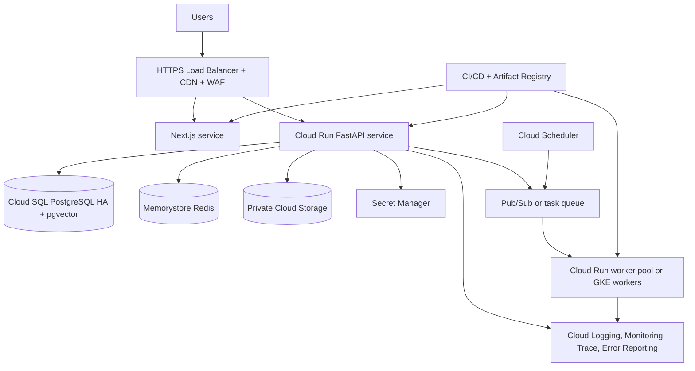

# PickReady Engineering and System Design

**Status:** Implementation-aligned technical specification
**Authority:** Source code, migrations, automated tests, runtime configuration, and shipped interfaces in this repository

## 1. Purpose

This document describes how PickReady is built today and the engineering path from the current credit-funded deployment to a production-grade service. It replaces older architecture prompts, API contracts, deployment notes, hand-offs, and feature specifications.

Historical documents are not authoritative. Where old intent and current behavior differ, this document records the implementation.

## 2. System context

PickReady is a web application with four authenticated workspaces and several public token/link workflows.



The frontend exposes a public site (including `/docs`) plus Provider, Company, Candidate, and Business Development route groups. The API contains shared v1 routes, current v2 workflow routes, and a small amount of backward-compatible surface.

## 3. Technology stack

| Layer | Implemented technology |
|---|---|
| Frontend | Next.js 16.2.12, React 18.3, TypeScript |
| UI | Tailwind CSS, Radix/shadcn primitives, Lucide icons, Framer Motion, Recharts |
| Frontend state/integration | Context-based auth/session, typed fetch client, Firebase client SDK |
| API | Python 3.12, FastAPI, Pydantic |
| Persistence | SQLAlchemy async ORM, asyncpg, Alembic |
| Database | PostgreSQL 16 with pgvector |
| Queue/cache | Redis 7, Celery worker and beat |
| AI orchestration | Provider router plus LangGraph-style parallel workflows |
| Identity | Firebase Authentication plus application-issued JWT sessions |
| Files | Cloudinary |
| Payments | Razorpay Subscriptions and webhooks |
| Email/SMS | Gmail SMTP with STARTTLS, MSG91 |
| Web research | Tavily |
| Containers | Docker; local composition through Docker Compose |
| API serving | Gunicorn with Uvicorn workers |
| Frontend serving | Next.js standalone production output |

The code uses **Groq**, not Grok.

## 4. Repository structure

```text
pickready/
├── backend/
│   ├── alembic/versions/      # Schema and data migrations
│   ├── app/api/               # FastAPI route groups
│   ├── app/core/              # Configuration, database, security, cache, instrumentation
│   ├── app/models/            # SQLAlchemy domain models
│   ├── app/prompts/           # Versioned AI prompt material
│   ├── app/schemas/           # API request/response contracts
│   ├── app/services/          # Domain and integration services
│   ├── app/workers/           # Celery configuration and tasks
│   └── tests/                 # Backend unit and integration tests
├── frontend/
│   ├── app/                   # Next.js route groups and pages
│   ├── components/            # Portal, workflow, and UI components
│   ├── lib/                   # API client, auth, types, helpers
│   └── public/                # Static assets
├── infra/                     # Compose and alternate platform deployment definitions
└── docs/                      # PRD.md and ESD.md
```

## 5. Architectural principles

### 5.1 Domain services behind thin routes

API routes validate access and transport contracts, while services own lifecycle, assessment, matching, billing, and outreach rules. This keeps provider integrations replaceable and makes core behavior testable.

### 5.2 Explicit workflow state

Jobs, applications, invitations, assessments, pipeline transitions, billing events, outreach leads, and verification requests store durable states. Background retries do not rely on in-memory progress.

### 5.3 Tenant isolation in depth

Tenant ID filtering is reinforced by PostgreSQL row-level security. The database session sets tenant context. Provider and BD operations use an explicit bypass scope where necessary, and those paths are audited.

### 5.4 Capability-based authorization

Roles provide default capability sets. Per-user grants and revocations form an overlay. Business routes check capabilities rather than embedding broad role-name conditionals.

### 5.5 Internal numeric computation, qualitative output

Numeric matching and assessment values are stored for calculation. `services/rating.py`
is the single place they become words, and it is the only rating scale in the
product: **Highly Matching / Matching / Moderately Matching / Not Matching**.
The conversion happens server-side, at the serializer, so a score cannot leak by
a caller forgetting to convert it.

Radar geometry uses a 1-4 band index as a rendering radius, because a radar has
no geometry without one. It is never displayed as a number, on an axis, a data
label or a tooltip.

This protects the product requirement that end users never see pseudo-precise AI
scores.

### 5.6 Idempotent external effects

Credit-ledger mutations, Razorpay webhooks, batch work, and task completion paths use stable event keys or state guards. Re-delivery cannot create a second billable event.

## 6. Data architecture

### 6.1 Core identity and tenancy

- users and Firebase identity mapping;
- refresh/session state and workspace context;
- tenants and company profiles;
- memberships, roles, capabilities, and per-user overrides;
- staff invitations; and
- append-only audit logs.

### 6.2 Hiring domain

- jobs and job-description snapshots;
- candidates, resumes, reusable profile form, and application snapshots;
- job-candidate links with acquisition source;
- embeddings and matching results;
- assessment conversations, messages and reports;
- per-job technical question banks and per-job PPI frameworks (`job_competencies`);
- per-candidate PPI questions (`candidate_questions`);
- mandatory application validation fields, snapshotted on the job-candidate link;
- team reviews;
- pipeline current state and append-only transition history;
- interview-stage rows;
- email logs; and
- employer-verification requests.

### 6.3 Commercial domain

- pricing plans;
- tenant subscriptions;
- billing transactions;
- append-only credit ledger; and
- reconciliation markers.

### 6.4 Business-development domain

- BD accounts and capabilities;
- leads and channel/source information;
- six progress timestamps;
- AI Reach runs and results; and
- lead-to-tenant prospect linkage.

### 6.5 Migration posture

Alembic migrations are additive through migration 0029. Later migrations add functional assessments, grade and permissions, profile snapshots, posting lifecycle, pipeline communications, provider operations, compliance capability, canonical JD content, BD, billing, performance indexes, and team reviews.

Production releases must run migrations as a one-off deployment job before traffic is shifted. Migrations must not run concurrently from every application replica.

## 7. Authentication and session design

### 7.1 Browser sign-in

Firebase client flows support:

- Google sign-in;
- email/password; and
- phone authentication.

The browser sends a Firebase ID token to `/api/v1/auth/firebase/session`. The API verifies it, resolves the user’s available workspaces, and creates application sessions.

### 7.2 Workspace selection

One identity may belong to more than one workspace. `/select-context` issues the audience and tenant context selected by the user.

Distinct JWT audiences are used for:

- provider owner;
- company;
- candidate.

BD sessions use the owner audience but carry no customer tenant context and are constrained by BD capabilities.

### 7.3 Session storage

Access, refresh, and session-hint values are stored in secure HTTP-only cookies. Refresh rotation and logout are server-controlled. Browser JavaScript does not need direct access to bearer tokens.

### 7.4 Compatibility code

OTP helpers remain in the backend, but the current interface uses Firebase. OTP code should be treated as migration debt, not as the primary authentication architecture.

## 8. Authorization and database isolation

Each request resolves:

1. authenticated identity;
2. selected workspace and JWT audience;
3. tenant context, when applicable;
4. membership status;
5. role defaults; and
6. individual grant/revoke overrides.

The resolved capability set is checked before business operations execute.

PostgreSQL RLS policies constrain tenant tables using session-local database variables. Provider read operations and BD provisioning use a deliberate bypass context. Bypass routes must remain narrow, logged, and covered by cross-tenant tests.

## 9. Job workflow



The current UI always creates a draft first. A compatibility API default can
publish immediately, but it is not the intended interface workflow.

Publishing and assessment readiness are INDEPENDENT states. A published job
accepts applications and ranks them immediately; it cannot invite anyone to an
assessment until the recruiter has finalised both halves of the setup
(section 12.1.2). Separating them is deliberate: making publish wait on the
review would hold the posting window closed over a step that only affects what
happens after a candidate has already applied.

Posting state is derived from publish, active-through, grace-through, archive, and renewal timestamps. Public lookup returns no job after the active window. Application editing checks the five-day grace boundary and prior application ownership.

## 10. Candidate intake, files, and parsing

Public application creates or updates a candidate and snapshots the reusable profile/resume onto the job-candidate relationship.

Resume storage:

- accepts PDF and DOCX;
- computes SHA-256 for content-addressed reuse;
- stores provider identifiers and metadata in PostgreSQL;
- serves files through authenticated routes;
- converts DOCX into sanitized HTML for browser preview; and
- falls back to download when inline preview is not available.

Bulk databank ingestion accepts up to 25 files and returns per-file success or error. Parsing and matching are queued once per accepted batch.

Current production storage is Cloudinary. The migration target is described in Section 24.

## 11. Matching architecture

### 11.1 Retrieval

The service obtains a candidate set from:

- BGE-M3-compatible 1024-dimension pgvector similarity;
- PostgreSQL full-text keyword retrieval; and
- candidate links already associated with the job.

The database has indexes for common tenant, lifecycle, status, and candidate-review paths.

### 11.2 Reranking

An LLM evaluates skills, experience, role/responsibility, and education. There
is **no weighting between the four** (2026-07-30). Each parameter is judged,
graded and commented on its own terms; Python owns the overall, which is their
plain mean:

```text
overall = (skills + experience + role_responsibility + education) / 4
```

The previous 0.35 / 0.30 / 0.20 / 0.15 table was removed for two reasons. The
weights were surfaced to the client as "35% role-fit weighting" beside each
remark, which is a number reaching a client. And a fixed weighting asserts that
skills matter 2.3x more than education for every role in the product, an
arithmetic the four AI comments do not perform and cannot defend when a customer
asks why.

The overall is internal only: it orders a candidate list and assigns a tier, and
never crosses the API boundary. `services/matching.py` has no `WEIGHTS` symbol,
and `tests/test_scoring.py` asserts its absence.

LLM parameter outputs use a constrained 1-10 range. Stored internal tiers are
derived deterministically. Client responses carry one of the four word grades
plus comments constrained to 25-30 words.

Compensation is removed from prompts. A small amount of PII-minimized historical positive-outcome context may be included, but cannot override the current JD.

### 11.3 Failure behavior

If provider reranking fails, retrieval results remain available. The fallback deliberately avoids assigning the highest recommendation tier. Matching requests should persist provider/fallback metadata for evaluation.

## 12. Assessment architecture

### 12.1 Bank generation

Technical questions are generated once per job and grade:

- Non-managerial: 20
- Managerial: 17
- Leadership: 15
- CXO: 12

Each question has a rubric. Schema validation and deterministic top-up guarantee
the required count. Generation NEVER approves: see 12.1.2.

#### 12.1.1 PPI framework generation

Alongside the technical bank, `services/ppi.generate_framework` produces the
job's evaluation framework from the same JD: at least 5 Primary Skills, 5
Secondary Skills and 5 Behavioural Competencies, each with a description and a
`required_level` (one of the four grade words, stored as that band's
representative internal score so the radar can plot the job's shape).

"Culture" is refused as a Behavioural Competency at three layers: the generator
prompt forbids it, `framework_is_complete` rejects it at save, and a Postgres
CHECK constraint on `job_competencies` refuses the row outright. A prompt
instruction is a request, not a guarantee, and the Hiring Manager's Edit control
can type anything.

Both generators are independent - neither reads what the other writes, and a
failure in one does not invalidate the other. They are nonetheless awaited in
sequence inside `pickready.generate_technical_questions`: an AsyncSession is not
safe to use from two concurrent tasks, and giving each its own session would
have them contend for a row lock on the same `jobs` row for a saving nobody is
waiting on.

#### 12.1.2 The review gate

`jobs.assessment_status` is `questions_pending_review` on creation and becomes
`ready_for_candidates` only when BOTH `questions_approved_at` and
`framework_approved_at` are stamped. `_refresh_setup_status` recomputes it after
either finalize handler, so neither has to know about the other's state.

Until the job is ready:

- `POST /assessments/conversations/links/{id}/start` refuses with 409; and
- `POST /pipeline/jobs/{id}/select-candidates` refuses with 409, so candidates
  are never mailed an assessment they cannot open.

A saved framework is frozen: add/update/delete return 409 until it is reopened,
and reopening is itself refused once any candidate has been assessed against it,
because a report is immutable and states a grade against those exact criteria.

`pickready.remind_unapproved_technical_questions` runs hourly and mails everyone
who could approve a job left pending past
`settings.technical_review_reminder_hours`. `question_reminder_sent_at` makes it
one reminder per job rather than an hourly nag.

#### 12.1.3 Per-candidate PPI questions

`services/ppi.generate_candidate_questions` runs per application, enqueued at
invitation so the questions are waiting when the candidate arrives. It allocates
the grade's question count (25/20/15/10) across the saved framework, one per
competency first so nothing is graded that was never probed, with the remainder
going to Primary Skills, then Behavioural, then Secondary. Each question is
generated from the JD, the framework entry, and that candidate's own resume, so
it could not have been asked of a different candidate unchanged.

Idempotent: a candidate who already has questions keeps exactly those, so a
Celery redelivery cannot hand someone a different assessment halfway through.

### 12.2 Invitation and conversation

The recruiter invitation endpoint:

- accepts no more than 200 candidate-link IDs;
- enforces capability and tenant ownership;
- blocks new sends when the credit balance is negative;
- creates or reuses invitation conversation records;
- queues communications; and
- returns per-candidate skipped reasons.

Starting requires a valid invitation. Messages are written one answer at a time. The full conversation is persisted for processing and audit.

### 12.3 Parallel scoring and synthesis



TWO scoring agents fan out and join at synthesis. Both key on the
`question_key` stamped on each transcript message: `str(TechnicalQuestion.id)`
for technical, `str(JobCompetency.id)` for PPI.

- **Technical scoring** applies each question's own rubric, then aggregates the
  per-question scores into one entry per distinct skill. `report_dimensions` is
  UNIQUE on (report_id, category, name), so emitting one row per question would
  raise IntegrityError on any bank that probed a skill twice.
- **PPI scoring** produces one entry per framework competency, in report order,
  each with a 45-50 word remark and the competency's `required_level` copied
  onto the row. Copying rather than joining is deliberate: a written report is a
  permanent record of the criteria it was written against, and the job's
  framework may be edited later.

`validation_capture` is a third graph node but NOT a third scorer. It copies the
application's `validation_json` into the report shape and touches no model; it
sits on the same fan-out only because synthesis needs its output.

Each scoring branch supports a deterministic fallback and records its scoring
mode on `functional_skills_reports.scoring_mode` (previously smuggled inside
`validation_json`, where a field about the run sat among fields the candidate
submitted).

#### 12.3.1 Report shape

`report_dimensions.category` is one of `matching`, `primary_skill`,
`secondary_skill`, `behavioural`, `technical`. `score` is internal and is
projected to one of four words by `services/rating.grade_for_percent` at the API
boundary; `required_level` is the job's requirement for the same item and is
null on matching and technical rows.

`build_radar_charts` produces four charts from the SAME dimension rows the
sections render, so a chart can never disagree with the text beside it. Each
axis carries `requirement_band` / `candidate_band` (words) and
`requirement_index` / `candidate_index` (a 1-4 rendering radius, never
displayed). The Overall chart plots the three PPI category aggregates and
deliberately excludes technical, which carries no job-requirement level and
would force the "Job Requirement" shape to invent a value for that spoke.

Assessment completion deducts one credit synchronously and queues report generation. The report write path is guarded against duplicate completion.

### 12.4 Report immutability and reuse

Report endpoints reject update and delete methods with an explicit 403 from a
registered handler, rather than an accidental 405.

Report **reuse is retired**. Under PPI the framework and the technical bank are
both generated from each job's own JD, so every section of a report is scoped to
the job it was written for; carrying one across would state a grade against
criteria the candidate was never assessed on - the identical error that has
always kept the matching section from travelling.
`services/retake.PORTABLE_CATEGORIES` is now an explicit empty frozenset rather
than deleted, so `copy_report` refuses loudly instead of a future caller
rediscovering reuse by accident. The six-month classification still runs, so the
candidate is told why they are answering questions again.

## 13. Hiring pipeline

The domain transition graph is server-enforced:

```text
applied -> assessment_invited | shortlisted
assessment_invited -> assessment_in_progress | assessment_completed
assessment_in_progress -> assessment_completed
assessment_completed -> shortlisted
shortlisted -> interview_scheduled | offer_extended
interview_scheduled -> interview_completed
interview_completed -> interview_scheduled | offer_extended
offer_extended -> joined
non-terminal -> hold | rejected
```

The API normalizes the legacy `offered` value to `offer_extended`.

Interview scheduling creates an incremented round/stage record and advances the candidate when allowed. Status changes append history and update the current-state mirror in one transaction.

Some system stages remain available for workflow compatibility even when the current UI does not display them as manual dropdown actions.

## 14. Communications and verification

### 14.1 Outbound communications

Lifecycle email content is generated through the provider router with a deterministic template fallback. Gmail SMTP uses STARTTLS on port 587. Delivery occurs in Celery, and email logs preserve:

- type;
- recipient;
- subject and body;
- queued/sent/failed state;
- provider error;
- AI-generated marker; and
- human-edited marker.

Application confirmation, assessment invitation/reminder/completion, shortlist, rejection, hold, interview scheduling/completion, offer, and joined events are implemented.

The historical question-bank reminder task is inert because the current workflow has no manual bank-approval gate.

### 14.2 Employer verification

The service creates tokenized requests, serves a public verification form, validates and stores responses, accepts parsed inbound email through an API, and supports audited override with a reason.

The repository does not include an inbound Gmail webhook/ingestion deployment. Production must connect an inbound email provider or mailbox ingestion service to the parsing endpoint.

## 15. Billing architecture

Razorpay Subscriptions owns external recurring-payment state. PickReady stores its plan mapping and subscription mirror. Webhook signatures are verified, and provider event IDs are deduplicated.

The credit ledger stores integer sub-units:

```text
1 credit = 60 sub-units
completed = 60
incomplete = 20
no-show = 4
old-profile review = 3
```

Consumption methods require a stable idempotency key. The ledger is append-only; balance is derived and mirrored for fast display.

Celery beat reconciles invitations after the seven-day settlement window. A candidate who started but did not finish incurs 20 sub-units; a candidate who never opened after reminders incurs four. A negative balance remains valid historical state but prevents new invitations.

## 16. Business-development architecture

Personal and social lead routes share a service and persistence model. The source enum distinguishes LinkedIn, Google, Facebook, Instagram, X, and direct/personal data.

Six boolean progress flags store first-completed timestamps. Agreement promotion creates a prospect tenant exactly once. Unsigning archives/unlinks it; re-signing restores and reuses the link.

AI Reach modes:

- `similar_to_customers`: internal matching only;
- `from_internet`: Tavily research with plan, search, evaluate, and shape steps.

The API reports `ok`, `unconfigured`, `timeout`, or `unavailable` rather than silently presenting failed research. Confidence is serialized as words.

## 17. AI provider router

### 17.1 Current providers and models

| Provider | Current model |
|---|---|
| Groq | `llama-3.3-70b-versatile` |
| Gemini / Google AI Studio | `gemini-2.0-flash` |
| OpenRouter | `meta-llama/llama-3.3-70b-instruct` |

The router supports up to seven configured keys per provider, round-robin selection, task-specific provider order, timeouts, and circuit breaking. Database-configured keys take precedence over environment keys.

### 17.2 Task preference

| Task | Provider order |
|---|---|
| JD generation | OpenRouter → Gemini → Groq |
| Technical questions | Gemini → OpenRouter → Groq |
| Behavioral content | Gemini → Groq → OpenRouter |
| Report synthesis | OpenRouter → Gemini → Groq |
| Email drafting | Groq → Gemini → OpenRouter |
| Candidate reranking | Groq → Gemini → OpenRouter |
| Structured extraction | Gemini → OpenRouter → Groq |

Interactive and background operations have separate budgets. Failed providers are skipped until their circuit recovers.

### 17.3 Production recommendation

Free-tier keys and aggregator routing are useful for development but are not a production availability contract. At scale:

1. Choose one enterprise, direct primary provider with contractual privacy, residency, throughput, support, and observability. Vertex AI Gemini is operationally aligned with a Google Cloud deployment; the OpenAI API is a viable direct alternative.
2. Keep a second direct provider as tested failover for non-provider-specific prompts.
3. Remove key rotation as a substitute for capacity planning. Use organization projects, service identities, budgets, quotas, and provisioned throughput where justified.
4. Define per-task model versions and evaluation sets before upgrades.
5. Redact/minimize candidate data, configure provider retention controls, and execute data-processing agreements.
6. Do not send candidate PII through an aggregator unless contractual controls and subprocessor terms are accepted.

Current reference material:

- [Vertex AI zero-data-retention controls](https://docs.cloud.google.com/vertex-ai/generative-ai/docs/vertex-ai-zero-data-retention)
- [OpenAI business data privacy](https://openai.com/business-data/)
- [OpenAI API data controls](https://platform.openai.com/docs/models/default-usage-policies-by-endpoint)

## 18. API organization

The FastAPI application groups routes by domain:

- authentication and context;
- companies, staff, capabilities, and compliance;
- jobs and public jobs;
- candidates, profiles, files, matching, and team reviews;
- assessments and reports;
- pipeline and emails;
- billing;
- provider;
- BD and outreach; and
- public employer verification.

Some mature workflows are exposed under `/api/v2`, while base resources and billing remain under `/api/v1`; selected routes are aliased for compatibility. The generated FastAPI OpenAPI explorer is the executable route contract for a running environment.

New clients should use the route version already used by the current frontend instead of selecting a version by number alone.

## 19. Background processing and schedules

Celery handles:

- resume parsing and embedding;
- candidate matching;
- technical-bank generation;
- assessment scoring and report synthesis;
- email delivery and reminders;
- web-research workflows; and
- billing reconciliation.

Celery beat schedules:

- dashboard summary refresh at approximately five-minute intervals;
- credit reconciliation hourly; and
- the legacy question-bank reminder task hourly, where it exits without action.

Workers must run as unprivileged processes and share the same release image/schema contract as the API.

## 20. Caching, pagination, and performance

Implemented controls include:

- Redis caching for hot public and dashboard data;
- a public-job cache measured in minutes;
- GZip for responses above approximately 1 KB;
- explicit pagination on candidate review and several list APIs;
- a 25-row candidate review page;
- batched resume ingestion;
- async database access;
- database indexes introduced in migration 0028;
- materialized dashboard refresh; and
- non-production request timing, SQL-query count, and `Server-Timing` instrumentation.

Not every list endpoint uses identical pagination. This should be standardized before high-volume onboarding.

## 21. Security and privacy

### Implemented controls

- Firebase identity verification;
- HTTP-only application cookies;
- JWT audience separation;
- capability checks;
- tenant RLS;
- audited provider bypass;
- signed Razorpay webhook verification;
- tokenized public application/verification workflows;
- authenticated document routes;
- sanitized DOCX preview;
- PII minimization in matching prompts;
- compensation removal before matching;
- rate limiting on selected public telemetry and token endpoints; and
- append-only operational/audit records.

### Critical repository hygiene issue

The working repository contains local plaintext secret material in `.env`, `api-keys.txt`, and `deployment-keys.txt`. No secret value should be copied into documentation or logs.

Before production:

1. rotate every exposed credential;
2. remove secret files from version control and developer hand-offs;
3. inspect and, if required, scrub Git history;
4. place runtime secrets in Google Secret Manager;
5. grant secrets to service identities only;
6. block secret patterns in pre-commit and CI; and
7. maintain a documented rotation and incident procedure.

## 22. Testing and verification

The backend has unit/integration coverage for:

- session lifecycle and Firebase authentication;
- tenant staff and capabilities;
- jobs and posting lifecycle;
- candidate profile and resume flows;
- matching and matching API behavior;
- functional assessments;
- pipeline transitions;
- email delivery;
- outreach and employer verification;
- provider operations;
- BD provisioning and portal workflows;
- billing, webhook, credits, and reconciliation; and
- platform audit scenarios.

Frontend coverage includes focused Vitest tests for payload shaping and validation helpers, plus TypeScript, lint, and production-build checks.

Current gaps:

- no comprehensive browser end-to-end suite across all four workspaces;
- no load-test baseline for matching/report bursts;
- no chaos/failover tests for AI providers, Redis, email, or Cloudinary;
- no automated accessibility audit in CI; and
- no production SLO or synthetic monitoring suite.

## 23. Engineering challenges and implemented resolutions

| Challenge | Implemented resolution | Remaining work |
|---|---|---|
| AI provider rate limits and failures | Task-aware routing, multiple keys, timeouts, circuit breaking, deterministic fallbacks | Enterprise quotas, evals, and provider SLAs |
| Semantic retrieval alone can miss exact terms | pgvector plus PostgreSQL full-text retrieval before LLM rerank | Relevance evaluation corpus and drift monitoring |
| Numeric AI scores imply false precision | Internal calculation with qualitative serialization | Calibrate word bands against outcomes |
| Retried payment/task events can double-charge | Append-only idempotent credit ledger and webhook dedupe | Reconciliation dashboards and operator tooling |
| Tenant leakage risk | Capability checks plus PostgreSQL RLS and audited bypass | Automated RLS policy tests on every migration |
| Long-running parsing and assessment work | Celery queues and durable workflow state | Queue autoscaling and dead-letter operations |
| Candidate data changes over time | Reusable main profile plus immutable per-application snapshots | Self-service retention and data-subject controls |
| Evolving specs created conflicting workflows | Current UI/API behavior selected as authority | Remove dormant compatibility paths |
| Rich DOCX viewing can introduce unsafe markup | Server-side conversion and sanitization | Malware scanning and isolated conversion service |

## 24. Storage strategy

### 24.1 Current state

Cloudinary stores resumes and compliance documents. PostgreSQL stores references, hashes, access metadata, and domain relationships.

### 24.2 Production target

Use private Google Cloud Storage buckets for candidate and compliance documents:

- separate buckets or prefixes by data class and environment;
- uniform bucket-level access;
- no public object ACLs;
- short-lived signed URLs only where direct download is required, otherwise authenticated proxy access;
- default encryption, with CMEK where customer or regulatory needs justify it;
- object versioning/soft-delete policy appropriate to recovery needs;
- lifecycle rules for temporary and retention-bound objects;
- malware scanning on upload before a file becomes available;
- immutable audit metadata in PostgreSQL;
- regional placement aligned with the data-processing policy; and
- tested export/deletion workflows.

Cloudinary can remain for public marketing imagery, where transformation and CDN delivery are its strength. It should not be the long-term system of record for private candidate and compliance documents.

See [Google Cloud Storage lifecycle management](https://docs.cloud.google.com/storage/docs/lifecycle).

### 24.3 Migration approach

1. Add a provider-neutral object-storage interface.
2. Implement a GCS adapter and dual-write behind a feature flag.
3. Backfill by content hash and verify byte size/checksum.
4. Switch reads to GCS with Cloudinary fallback.
5. observe, reconcile, and then disable document writes to Cloudinary;
6. apply retention policy before deleting legacy objects.

## 25. Current deployment reality

The application is container-ready and is currently described as running against free Google Cloud credits. The repository itself contains:

- Dockerfiles;
- local Docker Compose for PostgreSQL/pgvector, Redis, API, worker, beat, and frontend;
- Railway configuration; and
- Render configuration.

It does **not** contain:

- Google Cloud infrastructure as code;
- a checked-in Cloud Run or GKE deployment definition;
- GitHub Actions or Cloud Build pipelines;
- environment promotion policy;
- automated migration/release jobs; or
- disaster-recovery runbooks.

Therefore the exact current Google Cloud topology is external/manual configuration and cannot be reconstructed from source alone.

## 26. Production deployment architecture

### 26.1 Recommended Google Cloud baseline



Recommended components:

- Cloud Run for the FastAPI service;
- Vercel or Cloud Run for the Next.js standalone frontend;
- Cloud SQL for PostgreSQL with HA, backups, point-in-time recovery, pgvector, and connection pooling;
- Memorystore for Redis;
- Cloud Storage for private files;
- Secret Manager;
- Artifact Registry;
- Cloud Logging, Monitoring, Trace, Error Reporting, dashboards, and alerts;
- Cloud Armor/WAF and rate limiting at the edge; and
- a managed DNS/certificate path.

Cloud SQL supports the vector extension required by the current design. See [Cloud SQL PostgreSQL extensions](https://docs.cloud.google.com/sql/docs/postgres/extensions).

### 26.2 Worker decision

Celery is a long-running pull-worker model. There are two viable production paths:

- **Preserve Celery:** use Cloud Run worker pools where operationally suitable, or GKE Autopilot with queue-based autoscaling and a singleton beat deployment.
- **Move to managed events:** replace Celery routing gradually with Pub/Sub/Cloud Tasks and Cloud Scheduler, using idempotent Cloud Run handlers.

Do not run multiple uncontrolled beat replicas. Scheduled work must have one logical issuer or a distributed lease.

Cloud Run supports autoscaled container services and worker workloads, but maximum instances must protect database connection capacity. See [Cloud Run overview](https://docs.cloud.google.com/run/docs/overview/what-is-cloud-run) and [Cloud Run autoscaling](https://docs.cloud.google.com/run/docs/about-instance-autoscaling).

## 27. CI/CD and release strategy

Use GitHub Actions or Cloud Build with workload identity federation; do not store long-lived cloud keys in repository secrets.

### Pull request pipeline

1. secret scanning and dependency review;
2. Python lint/type checks and backend tests;
3. frontend lint, unit tests, type check, and production build;
4. migration graph validation;
5. container build;
6. software bill of materials and vulnerability scan; and
7. ephemeral integration tests with PostgreSQL/pgvector and Redis.

### Main-branch pipeline

1. build immutable images tagged by Git SHA;
2. push to Artifact Registry;
3. deploy to staging;
4. run migrations as a one-off job;
5. run API, portal, webhook, and worker smoke tests;
6. require approval for production;
7. deploy with canary or Cloud Run traffic splitting;
8. monitor error, latency, queue, and business-integrity signals; and
9. promote or roll back to the previous immutable revision.

Database changes must follow expand/migrate/contract so the old and new application versions can coexist during a rolling deployment.

## 28. Scaling strategy

### Stage 1: Harden the current service

- move secrets to Secret Manager;
- move documents to private GCS;
- use managed Cloud SQL and Memorystore;
- add CI/CD, tracing, metrics, SLOs, backups, and alerting;
- cap Cloud Run instances against the connection pool; and
- run provider and queue failure drills.

### Stage 2: Scale asynchronous throughput

- split worker queues by latency and resource profile;
- autoscale assessment, matching, resume, email, and research workloads independently;
- add dead-letter queues and replay tooling;
- cache model-independent artifacts;
- batch embedding calls where supported; and
- introduce load-shedding and tenant quotas.

### Stage 3: Enterprise resilience

- multi-zone database HA and tested point-in-time recovery;
- read replicas for analytics workloads;
- regional storage and retention controls;
- blue/green or progressive releases;
- enterprise AI throughput commitments;
- formal data-processing and incident programs; and
- multi-region recovery only after recovery objectives justify its complexity.

## 29. Observability and operational targets

The code currently offers structured logs and development request/query timing. Production should add:

- request rate, latency, error, and saturation by route;
- SQL pool usage, slow queries, locks, and replication health;
- Redis latency, memory, evictions, and queue depth;
- task age, retry count, dead-letter count, and success rate by task;
- LLM latency, token/cost, provider, model, fallback, and schema-failure rate;
- email and SMS delivery states;
- billing webhook lag and ledger reconciliation differences;
- application, invitation, completion, and report funnel metrics; and
- storage upload, malware-scan, and download failures.

Initial SLOs should be established from measured baselines, not invented in documentation. Error-budget policy should cover API availability, candidate application, assessment progress persistence, and billing integrity.

## 30. Current limitations and recommended remediation

| Priority | Limitation | Recommendation |
|---|---|---|
| Critical | Plaintext local secret files exist | Rotate, remove, scan history, and adopt Secret Manager plus CI secret scanning |
| High | No reproducible GCP infrastructure | Add Terraform for networks, services, identities, Cloud SQL, Redis, GCS, and monitoring |
| High | No CI/CD definitions | Implement the pipeline in Section 27 |
| High | No upload malware scanner | Quarantine, scan, release, and audit every private upload |
| High | Cloudinary is the private-document store | Migrate through the provider-neutral path in Section 24 |
| High | No production SLO/APM/synthetics | Add OpenTelemetry/cloud observability and business-integrity alerts |
| Medium | Inbound verification email is not operationally connected | Add a supported inbound-mail service and signature validation |
| Medium | Legacy OTP, approval, and question-bank paths remain | Inventory migrated data, deprecate routes, then remove code/schema safely |
| Medium | Full assessment transcript retains sensitive data | Add retention, redaction, export, deletion, and legal-hold policies |
| Medium | Browser E2E coverage is limited | Add Playwright journeys for each workspace and critical public links |
| Medium | Interview-round feedback tooling is incomplete | Add structured feedback, completion rules, and audit UI |
| Medium | List pagination is inconsistent | Standardize cursor/page contracts and limits |
| Medium | AI quality is not continuously evaluated | Add golden datasets, human review sampling, drift, bias, and fallback dashboards |
| Low | Development instrumentation is disabled in production | Replace with sampled production tracing and metrics |

## 31. Brief development history

The system evolved from a three-workspace hiring MVP into a four-workspace platform with provider administration, reusable candidate profiles, invitation-gated functional assessment, qualitative reporting, posting renewal, billing credits, compliance records, employer verification, and BD lead conversion.

During that evolution, several proposals were superseded. The current system no longer requires a separate 40-question validation interview or manual question-bank approval before publishing. Firebase sessions replaced the older primary OTP concept, and Gmail SMTP replaced the removed Mailtrap delivery service.

## 32. Concise technical roadmap

1. **Security and reproducibility:** rotate secrets, introduce GCP Terraform, managed storage, CI/CD, and malware scanning.
2. **Reliability:** add SLOs, tracing, queue operations, backups, recovery drills, and enterprise AI contracts.
3. **Quality:** build browser E2E, load tests, AI evaluation, and outcome calibration.
4. **Maintainability:** remove dormant compatibility paths and standardize API versions/pagination.
5. **Enterprise scale:** add retention/regional controls, enterprise identity, audit exports, and independently autoscaled workloads.
