# ReadyPick Product Requirements Document

**Status:** Implementation-aligned product specification
**Authority:** The running source code, database migrations, tests, and user interfaces in this repository

## 1. Purpose and source-of-truth policy

This document defines the product that is implemented today. It replaces earlier product briefs, questionnaires, hand-offs, prompts, and feature specifications.

When this document and the implementation differ, the implementation is authoritative until both are deliberately changed together. A feature is part of the product only when it is reachable through the current application or an active API/background workflow. Dormant compatibility code is not presented as an active user capability.

## 2. Product overview

ReadyPick is a multi-tenant hiring operations platform. It brings job creation, candidate intake, resume matching, structured assessment, functional reporting, hiring-pipeline communication, employer verification, subscription credits, and business-development operations into one system.

The product serves four workspaces:

| Workspace | Primary users | Purpose |
|---|---|---|
| Provider | ReadyPick owner and provider operators | Provision customers and BD accounts, inspect customer health, and view portfolio billing |
| Company | Company administrators, HR managers, recruiters, and hiring managers | Run jobs, candidate review, assessments, compliance, staff, billing, and hiring decisions |
| Candidate | Job applicants and sourced candidates | Maintain a reusable profile and resume, apply for jobs, complete invited assessments, and track applications |
| Business development | ReadyPick BD users | Manage personal and social leads, run AI-assisted reach, and convert signed prospects into customers |

The public website explains the platform and pricing and provides entry points for registration, login, public job applications, outreach responses, and employer verification.

## 3. Product principles

1. **The job remains the hiring anchor.** Candidate ranking, assessment content, reports, and workflow actions are scoped to a job.
2. **AI assists; deterministic rules protect continuity.** AI generates and evaluates content, while validation, fixed rubrics, fallbacks, and auditable workflow states keep operations usable when a provider is unavailable.
3. **Candidate-facing scores remain qualitative.** Numeric model scores are stored for computation but are not exposed in candidate tables, emails, or reports.
4. **Access is capability-based.** Tenant roles provide defaults, and individual grants or revocations refine what a staff member can do.
5. **Records are retained through lifecycle changes.** Jobs, customers, and related profiles are archived rather than destructively removed.
6. **Billing is event-ledger based.** Every credit mutation is append-only and idempotent.
7. **Tenant isolation is a product invariant.** Company data is isolated at both application and PostgreSQL row-policy levels.

## 4. Users, roles, and permissions

### 4.1 Provider owner

The provider owner can:

- view and search customers;
- inspect customer analytics, status, subscription, and credit balance;
- edit a limited provider-owned customer record: industry, website, and provider notes;
- archive or restore a customer;
- view customer compliance documents without changing them;
- provision, edit, enable, or disable BD accounts;
- view portfolio billing; and
- access owner settings.

The provider cannot use the provider interface to change customer contacts, staff, or compliance records.

### 4.2 Company administrator

The `client` account is the company administrator. It has company-wide responsibility for jobs, company information, staff, compliance, and billing, subject to its capabilities.

### 4.3 Company staff

Operational staff roles are:

- HR Manager
- Recruiter
- Hiring Manager

These roles use the same core operating areas: Jobs, Company Profile, Dashboard, and Settings. Access to Staff, Compliance, Billing, and other protected actions is capability-controlled rather than inferred only from the role name.

Company administrators can invite staff with a seven-day invitation token, resend invitations, disable or reactivate users, and add user-specific capability grants or revocations. A company can have at most five active Hiring Managers; HR Manager and Recruiter seats are not capped by this rule.

### 4.4 Candidate

A candidate owns a reusable profile and a main resume. A candidate can discover open jobs, apply through a public job link, view applications, edit an application during the configured grace period, and complete an assessment only after receiving an invitation.

### 4.5 Business-development user

BD access is governed by:

- `manage_bd_leads`
- `view_bd_customers`
- `use_ai_reach`

BD users do not operate inside a customer tenant and cannot access company hiring data through their BD role.

## 5. End-to-end hiring journey

```mermaid
flowchart LR
    A["Company profile"] --> B["AI-assisted job draft"]
    B --> C["Recruiter edits and publishes"]
    C --> C2["Technical bank generated and usable; PPI framework reviewed and saved"]
    C2 --> D["Public applications, sourced profiles, and databank uploads"]
    D --> E["Resume parsing and hybrid matching"]
    E --> F["Recruiter selects candidates"]
    F --> G["Invitation-gated unified conversation"]
    G --> H["PPI Assessment Report"]
    H --> I["Interview, offer, and join pipeline"]
    I --> J["Outcome history and reusable candidate records"]
```

## 6. Company setup and administration

### 6.1 Company profile

The company maintains structured content for:

- About the company
- Work life
- Benefits

These sections are snapshotted into a job so that a published job retains the company context used when it was created. A recruiter can override the snapshot for an individual job.

### 6.2 Compliance

The company can upload, replace, download, and remove these seven records:

1. GSTIN certificate
2. PAN
3. TAN
4. Bank account details
5. Signed agreement or schedule
6. Purchase order
7. MSME document

Provider users have read-only visibility. The current implementation stores compliance files through Cloudinary.

### 6.3 Dashboard

The company dashboard provides operational summaries derived from job, candidate, assessment, and pipeline data. Dashboard materialized data is refreshed by a recurring background task approximately every five minutes.

## 7. Job creation and publishing

### 7.1 Required job information

A job includes:

- title and structured role inputs;
- one grade: Non-managerial, Managerial, Leadership, or CXO;
- minimum and maximum experience;
- a stable reporting-to option, with an Other path;
- compensation information;
- company-profile snapshots; and
- a canonical Markdown job description.

### 7.2 Drafting workflow

The current company interface follows this sequence:

1. The recruiter enters the structured job inputs.
2. AI produces a unified Markdown job description.
3. The recruiter edits the generated Markdown.
4. The recruiter explicitly publishes the job.
5. The application returns a public link that can be shared on external channels.

The canonical job description is Markdown. A derived JSON representation is maintained for compatibility and downstream processing. The description remains editable.

The generated document uses seven stable sections:

- Description
- Role
- Responsibilities
- Accountabilities
- Education
- Skills
- Experience

### 7.3 Question generation

Creating a draft queues generation of **two** things, from the JD, independently
of each other:

- a grade- and job-specific **technical question bank**, each question carrying
  its own scoring rubric; and
- the job's **PPI evaluation framework** (section 11.2.1).

The service validates generated questions and tops up missing content
deterministically, so an LLM outage produces a usable draft rather than an empty
screen.

**The technical question bank has no approval step.** Generated questions are
usable the moment they exist. A recruiter may still edit or remove an individual
question, and the change takes effect immediately, but nothing waits on them.
The "Finalise questions" control is gone from the job setup screen.

**The PPI framework review remains, and it is the one manual step in an
otherwise fully automated pipeline.** The job enters `questions_pending_review`
and stays there until the framework is saved; only then does it become
`ready_for_candidates`. Until it does:

- no candidate can open the unified conversation; and
- no candidate can be invited - the invitation endpoint refuses and names the
  framework as what is outstanding.

Applications still arrive in the meantime and are ranked as normal.

The two halves are deliberately not treated alike, and the asymmetry is the
reason one survived. The framework is the fixed evaluation criteria **every**
candidate on the job is graded against, it is frozen once anyone has been
assessed, and a report states a grade against those exact criteria - so a human
confirming it is the product's only comparability guarantee. A technical
question is scored against its own rubric, so a weak one costs a single item on
a single report rather than making two reports incomparable.

An operational safeguard stops the surviving step going silent: a job whose
framework is left unapproved past a configured threshold (24-48 hours) mails
everyone who could approve it, once.

This supersedes the 2026-07-30 reinstatement **for the technical half only**.
The framework half of that decision stands.

### 7.4 Posting lifecycle

Each publication has:

- a 30-day active application window;
- a five-day grace period for existing applicants to edit an application; and
- an expired state after the grace period.

After the active window:

- the public job link no longer accepts or displays the job;
- a candidate who did not previously apply cannot create a new application;
- an existing applicant can edit only during the five-day grace period.

A job can be renewed only after its active window has closed. Renewal starts a new 30-day window. Candidates from the earlier posting remain visible as **Old Profiles**, while profiles from the renewed window are **New Profiles**.

Jobs can be archived and restored without deleting their candidate or history records.

## 8. Candidate acquisition and application

Candidate-job links identify how the candidate entered the workflow:

- **Applied:** submitted through the public job link;
- **Sourced:** entered through an external outreach link; or
- **Databank:** uploaded from the company’s existing candidate data.

The company can upload up to 25 resume files in one batch. Each file is validated independently, partial success is returned, and parsing/matching work is queued once for the accepted batch.

## 9. Candidate profile and resume

### 9.1 Reusable profile

The candidate profile is a structured form with these sections:

- personal information;
- education history;
- work experience;
- compensation and availability;
- document availability and onboarding readiness;
- resume confirmation; and
- candidate declaration.

The current minimum completion gate requires:

- current city;
- total experience;
- accepted declaration; and
- declaration full name.

The profile replaces the legacy proposal to ask a separate mandatory 40-question
validation interview in every assessment.

### 9.1.1 Mandatory application fields (validation)

Validation is no longer handled by an agent, and is no longer read from the
profile snapshot. It is six **mandatory fields on the application form itself**,
submitted together with the candidate's resume before they proceed any further:

| Field | Type |
|---|---|
| Current CTC | text |
| Expected CTC | text |
| Notice period | select |
| Earliest joining date | date |
| Document readiness | select |
| Why does this role interest you? | open text |

Three properties hold, and all three are deliberate:

1. **Nothing here is scored, interpreted or judged.** No agent reads it, no
   grade is attached, and the report shows it exactly as the candidate typed it.
   The recruiter, not any agent, decides whether a candidate's stated interest is
   genuine.
2. **It is captured before any assessment spend.** CTC and notice period at
   application time let a recruiter filter out candidates plainly outside the
   budget or notice window before a single credit is consumed assessing them.
3. **It lives on the application, not the candidate profile.** Current CTC and
   notice period change over time and are answered per opportunity, so each
   application stays an accurate record of what was true when it was submitted.

The field list is served by the backend, so the form a candidate fills in and
the Validation section of the report cannot drift apart. An application
submitted before 2026-07-30 predates these fields and renders as an explicit
"not collected" rather than a blank panel.

### 9.2 Resume handling

Candidates can upload or reuse their main resume. PDF and DOCX resumes are supported. A content hash avoids storing duplicate content. Files are accessed through authenticated preview or download endpoints. DOCX preview is converted to safe, monochrome HTML, with download as a fallback.

### 9.3 Application snapshot

Every application snapshots the candidate’s profile form and resume. Later edits to the reusable profile do not silently rewrite the historical application.

## 10. Matching and candidate review

### 10.1 Candidate retrieval

Matching combines:

- pgvector semantic similarity;
- PostgreSQL full-text keyword search; and
- candidates already linked to the job.

The retrieved set is reranked by an LLM. When an AI provider is unavailable, deterministic retrieval remains available and does not fabricate a top recommendation.

### 10.2 Matching dimensions

The internal composite uses:

| Dimension | Weight |
|---|---:|
| Skills | 35% |
| Experience | 30% |
| Role and responsibility alignment | 20% |
| Education | 15% |

Compensation data is removed before matching prompts are sent to an AI provider.

Prior positive outcomes for the same company can weakly influence reranking. These patterns are PII-minimized, and the current job description remains authoritative.

### 10.3 Ranking order

Candidate review order changes by grade:

- Non-managerial: skills, experience, then behavioral fit.
- Managerial, Leadership, and CXO: skills, behavioral fit, then experience.

The company candidate table is paginated at 25 rows. It provides source and old/new profile labels, qualitative match labels, five concise comments, resume viewing, reports, team reviews, and permitted status actions.

### 10.4 Rating policy

Numeric scores are internal and never cross the API boundary. Every rated item
in the product - the four matching parameters, Primary Skills, Secondary Skills,
Behavioural Competencies and the Overall grade - is shown to the client as one
of exactly four words:

| Grade |
|---|
| Highly Matching |
| Matching |
| Moderately Matching |
| Not Matching |

These four replaced the product's earlier pair of five-label scales (Very High /
High / Medium / Low / Developing for assessment dimensions, and Highly Matching /
Matching / Moderate / Low / No Matching for ranking comments). The two had to be
kept in step by hand, and a reader had no way to know that a "High" and a
"Matching" meant the same thing. One scale now, defined once in
`services/rating.py`.

Band boundaries are inclusive upward: a score landing exactly on a boundary
takes the higher grade.

The four matching parameters carry **no mathematical weightage**. Each is judged,
graded and commented on its own terms; the internal overall used for ordering a
candidate list is their plain mean and is never displayed.

## 11. Assessments

### 11.1 Invitation gate

Applying does not automatically start an assessment. A recruiter selects candidate links and sends assessment invitations. The batch endpoint supports up to 200 selections and reports skipped candidates with reasons.

An uninvited candidate receives no assessment access. The first accepted start changes the workflow to In Progress.

### 11.2 Assessment composition

One conversation, not two. A single unified conversational agent blends the
job's technical bank with the candidate's PPI questions into one natural
exchange; the candidate never sees or interacts with two separate bots and is
never told which engine scores which answer.

**The agent is adaptive, not a script.** It carries the conversation so far into
every turn, so it can refer back to what the candidate has already said and does
not re-tread ground. When an answer leaves something specific and material
unsaid - a claim with no outcome, a decision with no reasoning, an answer that
talks around the question - it asks a follow-up in the candidate's own terms
before moving on. A complete short answer is accepted as complete, and a
negative answer ("I have not used that") is accepted without pressing.

**The interview is bounded, and finishes.** At most one follow-up per question
and a fixed ceiling per conversation, so the number of turns can never exceed
the number of questions plus that ceiling however the model behaves. A follow-up
is extra evidence for a question already asked, never an extra question: it is
recorded against the same question it came from, so it reaches the same scorer,
and it does not change when the assessment is considered complete or when the
customer is charged.

If the model is unavailable the agent asks the next prepared question. An outage
costs the follow-ups and nothing else; it never costs a candidate their
assessment.

Validation is not asked here at all. It is six mandatory fields on the
application form (section 9.x), captured before the conversation begins.

| Job grade | Technical questions | PPI questions | Total |
|---|---:|---:|---:|
| Non-managerial | 20 | 25 | 45 |
| Managerial | 17 | 20 | 37 |
| Leadership | 15 | 15 | 30 |
| CXO | 12 | 10 | 22 |

Note the direction of the PPI column: more questions for a junior candidate,
fewer for a CXO. A CXO's evidence is broader per answer and their time is the
scarce resource.

### 11.2.1 ReadyPick Profile Intelligence (PPI)

PPI replaced the ReadyPick Functional Index (PFI) on 2026-07-30. PFI was one
fixed dimension set per grade, reused across every job in the product. PPI
generates a **fresh evaluation framework for every job, from that job's own JD**:

- at least 5 Primary Skills - capabilities the role cannot be performed without;
- at least 5 Secondary Skills - supporting capabilities that strengthen
  performance without being disqualifying;
- at least 5 Behavioural Competencies - observable workplace behaviours.

The agent may recommend more than five in any category when the job's complexity
warrants it. The trade, accepted explicitly: more precise to the specific role,
at the cost of no longer having one fixed list to point to across the product.

The agent never proposes **Culture** as a Behavioural Competency. Cultural fit
cannot be assessed accurately from a single assessment and PPI does not claim
otherwise. The refusal is enforced at generation, at save, and by a database
CHECK constraint.

PPI is a first-party framework and is not presented as DISC, MBTI, Hogan,
CliftonStrengths, or another licensed psychometric instrument.

**The framework is per job; the questions are per candidate.** Once the Hiring
Manager saves the framework it is the fixed evaluation criteria for every
candidate who applies to that job - that is the only reason two candidates'
reports are comparable. The questions probing it are generated individually from
the JD, the saved framework, and that candidate's own resume, so each
conversation is relevant to the person in it.

### 11.3 Assessment processing

Two independent scoring agents consume the relevant parts of the transcript in
parallel and do not wait on each other:

- **Technical scoring** - each answer against the rubric written for that
  specific question, never open-ended judgement, so a rating stays defensible
  when a client asks why a candidate was scored a certain way;
- **PPI scoring** - the candidate's responses against the job's saved Primary
  Skills, Secondary Skills and Behavioural Competencies.

Validation needs no scoring agent: it flows from the application form straight
into the report. Report synthesis waits for both scoring agents to complete.
Provider fallbacks and the scoring mode are recorded for audit.

**An answer with nothing in it to grade never reaches a scoring prompt.** Empty,
single-token and keyboard-mash answers are detected before scoring and routed to
the same "no usable evidence" outcome as an unanswered question: the lowest
grade, and a remark that says plainly that nothing was provided. The check is
deterministic and runs in-process, because the failure it guards against appears
precisely when the model is unavailable.

The check is deliberately conservative. It decides only whether there is text
worth scoring, never whether an answer is correct or relevant. "I have not
worked with Kafka" is a real answer and is passed through to be graded on its
merits, because wrongly discarding a real answer grades a real candidate down by
a route nobody can see.

**Scoring is reproducible.** Every agent that judges - technical scoring, PPI
scoring, report synthesis - runs deterministically, so the same answer produces
the same grade whenever it is scored. Only the conversational agent's phrasing
is allowed to vary, and what it asks is fixed by the framework regardless.

"Simultaneous" applies to backend scoring only, never to the candidate's
experience.

### 11.4 Retake behaviour

Every application runs its own assessment. Report reuse was retired with PPI:
the framework and the technical bank are generated from each job's own JD, so a
prior report grades criteria the new job never used, and carrying it across
would assert a result that was never assessed. The six-month classification
still runs so the candidate is told why they are answering questions again.

## 12. The PPI Assessment Report

The report is generated after assessment completion and is immutable through the
public application API. A retake produces a new report alongside the old one.

Every report shows **two distinct scores, deliberately kept separate rather than
merged** - one from before the candidate is assessed, one from after:

- **AI Score** - a resume-based snapshot generated before the assessment,
  comparing the resume against the four matching parameters.
- **PPI Assessment** - a conversation-based assessment grading the candidate's
  actual demonstrated skills and behavioural competencies against the job's
  saved framework.

They are not duplicating each other. A close match between the two confirms the
resume was accurate; a gap between them is itself useful signal, not a
contradiction to hide.

Section order is fixed:

1. **AI Score** - four matching parameters, each with a grade and a 25-30 word
   remark.
2. **Overall Assessment** - an Overall Grade, a 45-50 word Overall Remark, and
   the Overall radar chart. This opens the PPI Assessment section.
3. **Primary Skills** - a grade and a 45-50 word remark for each, plus a radar.
4. **Secondary Skills** - the same.
5. **Behavioural Competencies** - the same.
6. **Validation** - the mandatory application fields, shown as submitted, with
   no rating attached.
7. **Suggested interview questions** - 8 to 10, anchored on whichever Primary
   Skill, Secondary Skill, Behavioural Competency or technical item graded
   Moderately Matching or Not Matching. Clearly advisory input, never a
   recommendation to reject or accept.

Technical items are scored and anchor the suggested questions, but are not a
rendered section of the report.

### 12.1 Radar charts

Four per candidate - Overall, Primary Skills, Secondary Skills, Behavioural
Competencies - all part of the PPI Assessment, none part of the AI Score.

Each chart plots **two shapes on the same axes**: the job's required level and
the candidate's assessed level, so a client sees at a glance where a candidate
exceeds, meets, or falls short of what the job needs. A small legend below each
chart identifies the two shapes by word: Job Requirement, Candidate Assessment.

No numbers appear anywhere on any chart: not on axes, not as data labels, not in
tooltips. The radar uses an internal band index (1 to 4) purely as a rendering
radius; it is never displayed.

### 12.2 Word-count rules

- Primary Skills, Secondary Skills, Behavioural Competencies and the Overall
  Remark: **45-50 words**, doubled from the original 25-30 rule.
- The AI Score's matching parameters keep the original **25-30 words** - it is a
  snapshot, not the detailed assessment.
- Remarks must be genuinely reflective of that candidate's specific responses,
  not templated language with values swapped in.
- Validation output is exempt: factual data and the candidate's own words, not a
  rated remark.
- A remark is always generated complete inside its range and never truncated to
  fit.

## 13. Hiring pipeline and communications

### 13.1 Pipeline stages

The implemented domain includes:

- Applied
- Assessment Invited
- Assessment In Progress
- Assessment Completed
- Shortlisted
- Rejected
- Interview Scheduled
- Interview Completed
- Offer Extended
- Joined
- Hold

Rejected and Joined are terminal. Hold and Rejected can be selected from non-terminal states. Forward transitions are validated by the server. Multiple interview rounds are stored with incrementing stage numbers.

Every status change writes append-only history and updates the current-state mirror.

### 13.2 Email workflow

The system supports:

- application confirmation;
- assessment invitation and reminders;
- assessment completion;
- shortlist;
- rejection;
- hold;
- interview scheduling and completion;
- offer extension; and
- joined confirmation.

Messages can be AI-drafted with a deterministic fallback, edited by an authorized user where composition is offered, queued through Celery, and sent through configured Gmail SMTP. The log records subject, body, delivery status, whether AI generated the draft, and whether a person edited it.

### 13.3 Employer verification

Employment verification supports:

- creating a verification request;
- sending a tokenized public form;
- accepting a verified public response;
- parsing an inbound verification email through an API;
- recording an authorized manual override with a reason; and
- showing verification state with the candidate profile.

Databank handling follows separate verification rules so that historical profiles are not treated as fresh public applicants.

## 14. Billing and credits

### 14.1 Subscription plans

All self-service tiers offer the same implemented feature set and differ by monthly candidate allowance and unit economics.

| Plan | Monthly applications | Monthly price | Nominal price/application |
|---|---:|---:|---:|
| Starter | 50 | ₹10,000 | ₹200 |
| Growth | 100 | ₹18,000 | ₹180 |
| Scale | 150 | ₹24,000 | ₹160 |
| Pro | 200 | ₹28,000 | ₹140 |
| Enterprise | Contact sales | Custom | Custom |

Razorpay subscriptions provide checkout, plan change, cancellation, signature verification, and deduplicated webhook handling. Enterprise is a contact path rather than a self-service database plan.

### 14.2 Credit model

One credit equals 60 integer sub-units.

| Event | Sub-units | Credit equivalent |
|---|---:|---:|
| Completed assessment | 60 | 1 |
| Started but incomplete after reconciliation | 20 | 1/3 |
| Never opened after reminders and settlement window | 4 | 1/15 |
| Old-profile review | 3 | 1/20 |

Credits roll over and do not expire. Consumption can make a balance negative because a completed candidate action is not reversed. A negative balance blocks new assessment invitations until credits are restored.

Reminder attempts occur around 24 and 72 hours. Unfinished invitations are settled after seven days. Ledger entries are append-only and carry idempotency keys so retries do not double-charge.

**Demonstration companies are exempt from billing refusals, never from billing
records.** A small, explicitly flagged set of permanent demonstration tenants
behaves as fully paid customers: invitations are never blocked, no deficit is
ever raised against them, no payment is ever requested, and their balance is
presented as unlimited. Their usage is still recorded in the ledger exactly as
any other customer's, because the billing screens are part of what a
demonstration needs to show and a billing page with no usage on it demonstrates
nothing.

The exemption is a property of the specific tenant records, not of anything a
customer can acquire, and every other tenant continues to be metered, gated and
billed unchanged.

## 15. Business-development workspace

### 15.1 Lead management

Personal and social leads share one lead model. Social sources include LinkedIn, Google, Facebook, Instagram, and X.

Each lead tracks six operational milestones:

1. Interaction 1
2. Interaction 2
3. Interaction 3
4. Meeting or demo 1
5. Meeting or demo 2
6. Meeting or demo 3

The first completion time for each milestone is retained.

### 15.2 Agreement conversion

When an agreement is marked signed, the lead is promoted to a prospect customer tenant. Removing the signed state archives and unlinks the prospect. Signing again reuses the same tenant rather than creating duplicates.

### 15.3 AI Reach

AI Reach has two independent modes:

- **Similar to customers:** searches internal customer patterns without network access.
- **From the internet:** uses Tavily-backed research orchestrated through a plan, search, evaluate, and shape workflow.

Results identify operational states such as OK, unconfigured, timeout, or unavailable and use word confidence labels. AI Reach does not present an opaque numeric confidence score.

BD users can view converted customers and export their customer list as CSV.

## 16. Public experience

The public application includes:

- landing page;
- product storytelling and workflow demonstration;
- product and technical documentation;
- about;
- insights;
- pricing;
- privacy;
- terms;
- login and registration;
- staff invitation acceptance;
- public job application;
- outreach response; and
- employer verification.

Authentication supports Google, email/password, and phone through Firebase. The backend exchanges verified Firebase identity for secure HTTP-only application sessions.

**Nobody chooses their own workspace at sign-in.** The page asks for an email
address and a password, or offers Continue with Google, and nothing else. Which
portal a person lands in is decided entirely by the backend from the account's
own record - the invitation it was created from, or its account type - and the
frontend routes them there from what the sign-in returns. A context selector is
still shown in the one case it is genuinely needed: an identity that belongs to
more than one workspace, chosen **after** the backend has established which
workspaces those are.

The previous workspace picker was worse than redundant. Choosing an option never
granted the access it named - it was only ever a hint - so anyone who guessed
wrong received a refusal that read as a broken account rather than as a wrong
choice.

## 17. Product differentiation

The implemented differentiation is:

- one operating chain from job draft to joined outcome;
- hybrid semantic and keyword matching rather than an LLM-only candidate guess;
- assessment content that changes with both job and grade;
- PPI: a behavioural and skills framework generated fresh from every job, combined with technical rubric scoring;
- qualitative, interview-ready reports instead of exposed black-box numbers;
- invitation-gated assessment spend with a transparent fractional credit ledger;
- reusable candidate profiles with per-application snapshots;
- archived records and renewed-job old/new profile continuity;
- tenant-level capabilities plus individual permission overlays; and
- business-development conversion in the same platform that provisions customers.

These are implementation characteristics, not claims that competing products lack similar functionality.

## 18. Measurable value and evidence policy

The codebase provides measurable operating limits and unit economics:

- 22–45 assessment questions depending on grade;
- four matching parameters, unweighted;
- at least 15 PPI framework entries per job (5 Primary, 5 Secondary, 5 Behavioural);
- four radar charts per candidate report;
- 25 candidate rows per review page;
- 25 resumes per batch upload;
- 200 candidates per invitation batch;
- 30 active posting days plus five grace days;
- five-minute dashboard refresh;
- ₹140–₹200 nominal self-service cost per monthly application allowance; and
- fractional charging for incomplete, no-show, and old-profile-review events.

The current repository does **not** contain production telemetry proving hours saved, cost saved, conversion uplift, accuracy, retention, or time-to-hire improvement. Marketing must not present such figures as proven.

To establish defensible value, production analytics should measure:

- median time from job form start to publication;
- recruiter review minutes per candidate;
- percentage of matched candidates invited;
- invitation-open and assessment-completion rates;
- report-to-interview conversion;
- time from application to first decision;
- cost per completed assessment and per joined candidate;
- old-profile reuse rate;
- provider fallback rate; and
- hiring outcomes by match and report band.

Customer-facing claims should be released only after cohort definition, consent, sample size, and calculation methods are documented.

## 19. Explicit exclusions and superseded behavior

The following older concepts are not active product requirements:

- a separate 40-question validation conversation in every assessment (validation is now six mandatory application fields, section 9.1.1);
- a total 72–80 question assessment derived from that older design;
- a multi-level job approval workflow in the current company interface;
- automatic assessment access immediately after applying;
- numeric match or assessment scores exposed to users;
- provider editing of customer staff or compliance;
- feature gating by paid plan tier;
- an unlimited Hiring Manager count;
- a Mailtrap-based production email service; and
- a claim that “Grok” is an implemented AI provider. The code uses **Groq**, Gemini, and OpenRouter.

Compatibility tables, endpoints, or helpers may remain in the repository for migrated records. Their presence alone does not make these items current user workflows.

## 20. Quality requirements

### 20.1 Security and privacy

- Every tenant-bound query must preserve row-level tenant isolation.
- Provider bypass operations must be explicitly scoped and audited.
- Sensitive files must require authenticated access.
- Secrets must not be committed or embedded in browser bundles.
- Public token endpoints must be rate-limited and expire or settle according to their workflow.
- Candidate data sent to AI providers must be minimized.

### 20.2 Reliability

- Background tasks must be retry-safe and idempotent.
- Billing webhooks and ledger events must deduplicate repeated delivery.
- AI workflows must record provider/fallback mode.
- A provider outage must degrade to deterministic output where implemented rather than corrupt workflow state.

### 20.3 Accessibility and responsive behavior

- Public and portal navigation must remain keyboard accessible.
- Controls must have visible focus and usable labels.
- Data tables must have mobile alternatives or horizontal containment.
- Motion must respect reduced-motion preferences.
- Color cannot be the only carrier of a status or rating.

## 21. Current product limitations

- Quantified customer ROI is not instrumented.
- Provider customer editing is intentionally narrow.
- Employer-verification inbound email parsing has an API, but production inbound-mail delivery still needs an operational provider integration.
- Interview rounds are stored, but feedback and round-completion tooling are less complete than scheduling.
- AI fallbacks preserve workflow continuity but do not replace human review of high-stakes hiring decisions.
- Some dormant legacy models and endpoints remain and can confuse maintainers.
- File retention, malware scanning, data-subject workflows, and regional processing policies require production hardening.

## 22. Concise roadmap

### Near term

- add product analytics for the evidence metrics in Section 18;
- complete interview feedback and round-management UX;
- integrate production inbound email for verification;
- harden file security, retention, and malware scanning;
- remove dormant multi-level job-approval and OTP paths after migration review; and
- add end-to-end regression coverage for the four workspaces.

### Scale stage

- introduce enterprise identity and audit exports;
- support configurable hiring workflows without breaking the default pipeline;
- add customer-controlled retention and regional data policies;
- build outcome-calibrated matching evaluation with bias and quality monitoring; and
- expose operational service health and SLA reporting for enterprise customers.
