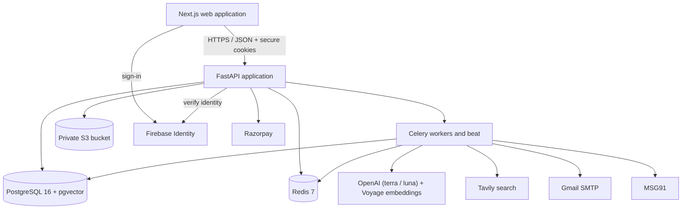
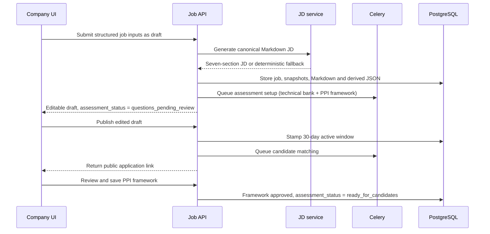
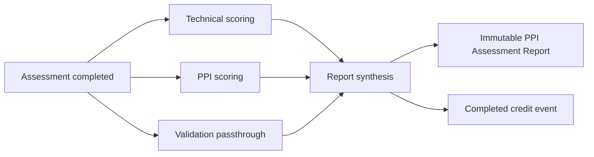
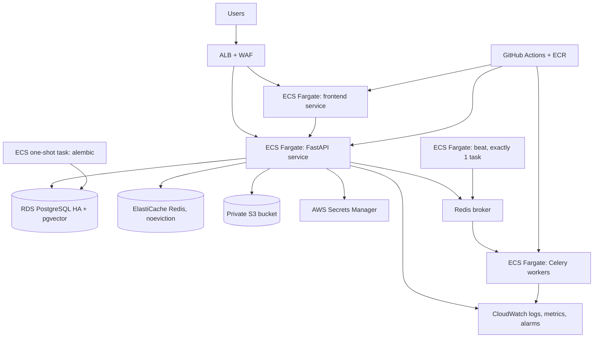

> **CORRECTIONS IN FORCE (last updated 2026-09-01).** Read these before
> trusting a section that contradicts them.
>
> **Deployment.** Sections 25 and 26 were rewritten on 2026-09-01 and now
> describe the AWS target. ReadyPick runs on AWS ECS Fargate, RDS PostgreSQL,
> ElastiCache and S3, defined as Terraform in `infra/`. Any surviving mention
> of Google Cloud elsewhere in this document is a leftover, not a plan. See
> [operations/DEPLOY_AWS.md](../operations/DEPLOY_AWS.md). No live AWS deploy
> has been executed; an offline plan succeeds and proves only internal
> consistency.
>
> **Models.** Section 17 describes a three-provider router that no longer
> exists. The platform runs on ONE vendor and three endpoints:
> `gpt-5.6-terra` (judge and write), `gpt-5.6-luna` (extract and classify) and
> `voyage-4` (embeddings). The 21-key roster, the capacity registry and the
> dynamic scheduler were deleted, not disabled. Section 17 has been rewritten
> below; the tables it used to carry are gone.
>
> **Storage.** Section 24 was rewritten and describes the implemented S3
> layout. Private documents live in a content-addressed **S3** bucket, reached
> only through authenticated, tenant-scoped, capability-checked routes.
> Cloudinary is not in the request path.
>
> The rest of this document -- the data model, the RBAC engine, the approval
> FSM, the matching pipeline -- is unchanged and still authoritative.

---

# ReadyPick Engineering and System Design

**Status:** Implementation-aligned technical specification
**Authority:** Source code, migrations, automated tests, runtime configuration, and shipped interfaces in this repository

## 1. Purpose

This document describes how ReadyPick is built today and the engineering path from the current credit-funded deployment to a production-grade service. It replaces older architecture prompts, API contracts, deployment notes, hand-offs, and feature specifications.

Historical documents are not authoritative. Where old intent and current behavior differ, this document records the implementation.

## 2. System context

ReadyPick is a web application with four authenticated workspaces and several public token/link workflows.



The frontend exposes a public site (including `/docs`) plus Provider, Company, Candidate, and Business Development route groups. The API contains shared v1 routes, current v2 workflow routes, and a small amount of backward-compatible surface.

## 3. Technology stack

| Layer | Implemented technology |
|---|---|
| Frontend | Next.js 16.2.12, React 18.3, TypeScript |
| UI | Tailwind CSS, Radix/shadcn primitives, Lucide icons, Framer Motion, Recharts |
| Frontend state/integration | Context-based auth/session, typed fetch client, Firebase client SDK |
| API | Python 3.12, FastAPI, Pydantic |
| Persistence | SQLAlchemy async ORM, asyncpg, Alembic |
| Database | PostgreSQL 16 with pgvector |
| Queue/cache | Redis 7, Celery worker and beat |
| AI orchestration | Single-vendor router (`services/llm_router`) with per-task timeouts, wall-clock budgets, bounded retries and a circuit breaker; LangGraph drives the retry state machine |
| Identity | Firebase Authentication plus application-issued JWT sessions |
| Files | Private S3 bucket, content-addressed by sha256 |
| Payments | Razorpay Subscriptions and webhooks |
| Email/SMS | Gmail SMTP with STARTTLS, MSG91 |
| Web research | Tavily |
| Containers | Docker; local composition through Docker Compose |
| API serving | Gunicorn with Uvicorn workers |
| Frontend serving | Next.js standalone production output |

Models: `gpt-5.6-terra` for judging and writing, `gpt-5.6-luna` for
extraction and classification, `voyage-4` for every embedding. No other model
id may appear in executable source, and a test greps for one.

## 4. Repository structure

```text
pickready/
├── backend/
│   ├── alembic/versions/      # Schema and data migrations
│   ├── app/api/               # FastAPI route groups
│   ├── app/core/              # Configuration, database, security, cache, instrumentation
│   ├── app/models/            # SQLAlchemy domain models
│   ├── app/prompts/           # Versioned AI prompt material
│   ├── app/schemas/           # API request/response contracts
│   ├── app/services/          # Domain and integration services
│   ├── app/workers/           # Celery configuration and tasks
│   └── tests/                 # Backend unit and integration tests
├── frontend/
│   ├── app/                   # Next.js route groups and pages
│   ├── components/            # Portal, workflow, and UI components
│   ├── lib/                   # API client, auth, types, helpers
│   └── public/                # Static assets
├── infra/                     # Compose and alternate platform deployment definitions
└── docs/                      # PRD.md and ESD.md
```

## 5. Architectural principles

### 5.1 Domain services behind thin routes

API routes validate access and transport contracts, while services own lifecycle, assessment, matching, billing, and outreach rules. This keeps provider integrations replaceable and makes core behavior testable.

### 5.2 Explicit workflow state

Jobs, applications, invitations, assessments, pipeline transitions, billing events, outreach leads, and verification requests store durable states. Background retries do not rely on in-memory progress.

### 5.3 Tenant isolation in depth

Tenant ID filtering is reinforced by PostgreSQL row-level security. The database session sets tenant context. Provider and BD operations use an explicit bypass scope where necessary, and those paths are audited.

### 5.4 Capability-based authorization

Roles provide default capability sets. Per-user grants and revocations form an overlay. Business routes check capabilities rather than embedding broad role-name conditionals.

### 5.5 Internal numeric computation, qualitative output

Numeric matching and assessment values are stored for calculation. `services/rating.py`
is the single place they become words, and it is the only rating scale in the
product: **Highly Matching / Matching / Moderately Matching / Not Matching**.
The conversion happens server-side, at the serializer, so a score cannot leak by
a caller forgetting to convert it.

Radar geometry uses a 1-4 band index as a rendering radius, because a radar has
no geometry without one. It is never displayed as a number, on an axis, a data
label or a tooltip.

This protects the product requirement that end users never see pseudo-precise AI
scores.

### 5.6 Idempotent external effects

Credit-ledger mutations, Razorpay webhooks, batch work, and task completion paths use stable event keys or state guards. Re-delivery cannot create a second billable event.

## 6. Data architecture

### 6.1 Core identity and tenancy

- users and Firebase identity mapping;
- refresh/session state and workspace context;
- tenants and company profiles;
- memberships, roles, capabilities, and per-user overrides;
- staff invitations; and
- append-only audit logs.

### 6.2 Hiring domain

- jobs and job-description snapshots;
- candidates, resumes, reusable profile form, and application snapshots;
- job-candidate links with acquisition source;
- embeddings and matching results;
- assessment conversations, messages and reports;
- per-job technical question banks and per-job PPI frameworks (`job_competencies`);
- per-candidate PPI questions (`candidate_questions`);
- mandatory application validation fields, snapshotted on the job-candidate link;
- team reviews;
- pipeline current state and append-only transition history;
- interview-stage rows;
- derived project evidence (`candidate_projects`), carrying evidence
  dimensions, evidence units, the AI interpretation in its own column, and the
  deletion ledger for temporary originals;
- the compiled Company DNA artifact and the per-job binding recording which
  version a scorecard was frozen against;
- the shared evidence ledger (`evidence_items`, `evidence_claims`,
  `evidence_claim_links`), which stores a REFERENCE to where a sentence lives
  and never the sentence;
- evaluations, review dispositions and calibration records;
- retrieval chunks (`context_chunks`) with their own vectors, distinct from the
  profile and job vectors that rank candidates;
- agent execution traces, which carry identifiers, counts and timings and never
  content;
- append-only micro-event telemetry (`telemetry_events`);
- email logs; and
- employer-verification requests.

### 6.3 Commercial domain

- pricing plans;
- tenant subscriptions;
- billing transactions;
- append-only credit ledger; and
- reconciliation markers.

### 6.4 Business-development domain

- BD accounts and capabilities;
- leads and channel/source information;
- six progress timestamps;
- AI Reach runs and results; and
- lead-to-tenant prospect linkage.

### 6.5 Migration posture

Alembic migrations are additive through migration 0029. Later migrations add functional assessments, grade and permissions, profile snapshots, posting lifecycle, pipeline communications, provider operations, compliance capability, canonical JD content, BD, billing, performance indexes, and team reviews.

Production releases must run migrations as a one-off deployment job before traffic is shifted. Migrations must not run concurrently from every application replica.

## 7. Authentication and session design

### 7.1 Browser sign-in

Firebase client flows support:

- Google sign-in;
- email/password; and
- phone authentication.

The browser sends a Firebase ID token to `/api/v1/auth/firebase/session`. The API verifies it, resolves the user’s available workspaces, and creates application sessions.

### 7.2 Workspace selection

**The sign-in form does not ask.** It collects an email address and a password,
or offers Continue with Google. Which portal the user reaches is resolved
server-side from the account record and returned by the session exchange; the
frontend routes on that answer. A `?portal=` query parameter still deep-links
(candidate apply links rely on it) but there is no control that sets it.

`/select-context` survives for the case it was actually needed for: one identity
belonging to more than one workspace, choosing between workspaces the backend
has already resolved. That is a disambiguation among real memberships, not a
declaration of intent.

Every authenticated shell persistently renders the active workspace name.
`POST /auth/workspaces` reopens the server-resolved chooser for an existing
session. Selection overwrites the portal cookie, records the previous and
selected contexts in the append-only audit log, disables authenticated HTTP
caching, and changes a tenant-keyed React boundary so all page-local state is
remounted even when switching within the same route. Billing and company-profile
pages require an explicit destination confirmation before switching.

The removed picker was a hint, never an authorization. Selecting "Provider
owner" granted nothing, so a wrong guess produced a refusal indistinguishable
from a broken account.

Distinct JWT audiences are used for:

- provider owner;
- company;
- candidate.

BD sessions use the owner audience but carry no customer tenant context and are constrained by BD capabilities.

### 7.3 Session storage

Access, refresh, and session-hint values are stored in secure HTTP-only cookies. Refresh rotation and logout are server-controlled. Browser JavaScript does not need direct access to bearer tokens.

`tenants` and `users` have enabled and forced PostgreSQL RLS. Ordinary company
sessions see only their selected tenant. Login, refresh, and workspace
resolution are the documented structural exception: they use the explicit
identity-resolution bypass scope because memberships must be found before a
tenant is known. Business endpoints cannot use that scope.

### 7.4 Compatibility code

OTP helpers remain in the backend, but the current interface uses Firebase. OTP code should be treated as migration debt, not as the primary authentication architecture.

## 8. Authorization and database isolation

Each request resolves:

1. authenticated identity;
2. selected workspace and JWT audience;
3. tenant context, when applicable;
4. membership status;
5. role defaults; and
6. individual grant/revoke overrides.

The resolved capability set is checked before business operations execute.

PostgreSQL RLS policies constrain tenant tables using session-local database variables. Provider read operations and BD provisioning use a deliberate bypass context. Bypass routes must remain narrow, logged, and covered by cross-tenant tests.

## 9. Job workflow



The current UI always creates a draft first. A compatibility API default can
publish immediately, but it is not the intended interface workflow.

Publishing and assessment readiness are INDEPENDENT states. A published job
accepts applications and ranks them immediately; it cannot invite anyone to an
assessment until the recruiter has saved the PPI framework
(section 12.1.2). Separating them is deliberate: making publish wait on the
review would hold the posting window closed over a step that only affects what
happens after a candidate has already applied.

Posting state is derived from publish, active-through, grace-through, archive, and renewal timestamps. Public lookup returns no job after the active window. Application editing checks the five-day grace boundary and prior application ownership.

## 10. Candidate intake, files, and parsing

Public application creates or updates a candidate and snapshots the reusable profile/resume onto the job-candidate relationship.

Resume storage:

- accepts PDF and DOCX;
- computes SHA-256 for content-addressed reuse;
- stores provider identifiers and metadata in PostgreSQL;
- serves files through authenticated routes;
- converts DOCX into sanitized HTML for browser preview; and
- falls back to download when inline preview is not available.

Bulk databank ingestion accepts up to 25 files and returns per-file success or error. Parsing and matching are queued once per accepted batch.

Private documents live in a content-addressed S3 bucket (Section 24). The object key is the sha256 of the bytes, so a retried upload resolves to the object already stored instead of creating a second one.

Project Evidence Intelligence (`app/services/projects/`, migration 0074) processes optional candidate project submissions, files and public repository links, into a persisted `candidate_projects` row of derived evidence: deterministic parser-router extraction first, one bounded reasoning call second, on the standard router (`project_evidence` task type). Uploads are untrusted input: archives are inspected before extraction (traversal, symlinks, decompression bombs, nesting, entry floods), no candidate code is ever executed, and all limits are `PROJECT_*` settings. Originals are staged temporarily under the `project-intake/` object prefix and deleted with HEAD verification only after evidence persists; deletion failures are counted on the row and retried by the hourly `pickready.reconcile_project_intake` sweeper. **Original project artifacts are not retained in this product phase; only the derived, structured evidence is persisted.** See `docs/spec/PROJECT_EVIDENCE_INTELLIGENCE.md`.

## 11. Matching architecture

### 11.1 Retrieval

The service obtains a candidate set from:

- BGE-M3-compatible 1024-dimension pgvector similarity;
- PostgreSQL full-text keyword retrieval; and
- candidate links already associated with the job.

The database has indexes for common tenant, lifecycle, status, and candidate-review paths.

### 11.2 Reranking

An LLM evaluates skills, experience, role/responsibility, and education. There
is **no weighting between the four** (2026-07-30). Each parameter is judged,
graded and commented on its own terms; Python owns the overall, which is their
plain mean:

```text
overall = (skills + experience + role_responsibility + education) / 4
```

The previous 0.35 / 0.30 / 0.20 / 0.15 table was removed for two reasons. The
weights were surfaced to the client as "35% role-fit weighting" beside each
remark, which is a number reaching a client. And a fixed weighting asserts that
skills matter 2.3x more than education for every role in the product, an
arithmetic the four AI comments do not perform and cannot defend when a customer
asks why.

The overall is internal only: it orders a candidate list and assigns a tier, and
never crosses the API boundary. `services/matching.py` has no `WEIGHTS` symbol,
and `tests/test_scoring.py` asserts its absence.

LLM parameter outputs use a constrained 1-10 range. Stored internal tiers are
derived deterministically. Client responses carry one of the four word grades
plus comments constrained to 25-30 words.

Compensation is removed from prompts. A small amount of PII-minimized historical positive-outcome context may be included, but cannot override the current JD.

### 11.3 Failure behavior

If provider reranking fails, retrieval results remain available. The fallback deliberately avoids assigning the highest recommendation tier. Matching requests should persist provider/fallback metadata for evaluation.

## 12. Assessment architecture

### 12.1 Bank generation

Technical questions are generated once per job and grade:

- Non-managerial: 20
- Managerial: 17
- Leadership: 15
- CXO: 12

Each question has a rubric. Schema validation and deterministic top-up guarantee
the required count. Generation NEVER approves: see 12.1.2.

#### 12.1.1 PPI framework generation

Alongside the technical bank, `services/ppi.generate_framework` produces the
job's evaluation framework from the same JD: at least 5 Primary Skills, 5
Secondary Skills and 5 Behavioural Competencies, each with a description and a
`required_level` (one of the four grade words, stored as that band's
representative internal score so the radar can plot the job's shape).

"Culture" is refused as a Behavioural Competency at three layers: the generator
prompt forbids it, `framework_is_complete` rejects it at save, and a Postgres
CHECK constraint on `job_competencies` refuses the row outright. A prompt
instruction is a request, not a guarantee, and the Hiring Manager's Edit control
can type anything.

Both generators are independent - neither reads what the other writes, and a
failure in one does not invalidate the other. They are nonetheless awaited in
sequence inside `pickready.generate_technical_questions`: an AsyncSession is not
safe to use from two concurrent tasks, and giving each its own session would
have them contend for a row lock on the same `jobs` row for a saving nobody is
waiting on.

#### 12.1.2 The review gate

`jobs.assessment_status` is `questions_pending_review` on creation and becomes
`ready_for_candidates` when `framework_approved_at` is stamped.
`_refresh_setup_status` recomputes it from that column alone.

The technical bank no longer gates anything: generated questions are usable
immediately, and editing or removing one takes effect at once. It is not a gate
in either direction - approving the bank alone does not open a job, or removing
one gate would have removed both and candidates would be assessed against
criteria nobody confirmed.

`questions_approved_at` is still stamped by the surviving finalize route and is
now read by nothing. It was deliberately not dropped in the same change that
stopped reading it, so a rollback needs no data restore.

The asymmetry is the point. The framework is the fixed criteria every candidate
on the job is graded against and is frozen once anyone has been assessed, so a
human confirming it is the comparability guarantee. A technical question is
scored against its own rubric, so a weak one costs one item on one report.

Until the job is ready:

- `POST /assessments/conversations/links/{id}/start` refuses with 409; and
- `POST /pipeline/jobs/{id}/select-candidates` refuses with 409, so candidates
  are never mailed an assessment they cannot open.

A saved framework is frozen: add/update/delete return 409 until it is reopened,
and reopening is itself refused once any candidate has been assessed against it,
because a report is immutable and states a grade against those exact criteria.

`pickready.remind_unapproved_technical_questions` keeps its name and hourly
schedule but now chases an unapproved FRAMEWORK, measured against
`framework_generated_at` alone. It previously took the earlier of the two
generation stamps, which after the gate change would chase a job whose framework
had only just been generated because its technical questions happened to be
older - and since `question_reminder_sent_at` allows one reminder per job, that
would spend it on a review nobody was late on.

#### 12.1.3 Per-candidate PPI questions

`services/ppi.generate_candidate_questions` runs per application, enqueued at
invitation so the questions are waiting when the candidate arrives. It allocates
the grade's question count (25/20/15/10) across the saved framework, one per
competency first so nothing is graded that was never probed, with the remainder
going to Primary Skills, then Behavioural, then Secondary. Each question is
generated from the JD, the framework entry, and that candidate's own resume, so
it could not have been asked of a different candidate unchanged.

Idempotent: a candidate who already has questions keeps exactly those, so a
Celery redelivery cannot hand someone a different assessment halfway through.

### 12.2 Invitation and conversation

The recruiter invitation endpoint:

- accepts no more than 200 candidate-link IDs;
- enforces capability and tenant ownership;
- blocks new sends when the credit balance is negative;
- creates or reuses invitation conversation records;
- queues communications; and
- returns per-candidate skipped reasons.

Starting requires a valid invitation. Messages are written one answer at a time. The full conversation is persisted for processing and audit.

**Adaptive follow-ups.** Each submitted answer is evaluated for whether anything
specific and material is missing; if so the agent composes one follow-up against
the transcript so far, which is read back from the persisted messages rather
than held in process memory (each turn is an independent stateless request).

Three invariants constrain the mechanism, and each is covered by an integration
test because each fails silently if broken:

- **Grouping.** A follow-up is recorded under the *same* question key as the
  question that produced it, so its answer joins that question's group for
  scoring. A new key would be dropped without error, because nothing iterates
  keys the framework did not define.
- **Billing.** A follow-up does not extend the question list and does not
  advance the question index. Completion, and therefore the charge, still fires
  after exactly the same set of base questions.
- **Completion.** A follow-up outstanding on the final base question holds
  completion open, so the customer is not charged and scoring is not dispatched
  while the candidate is still answering.

Termination is structural rather than conventional: at most one follow-up per
base question and a fixed per-conversation ceiling, held in a persisted counter
so it survives a retry or a message that fails to write. Turns are bounded by
question count plus that ceiling.

Every failure path - provider outage, timeout, unparseable response, an
over-long or empty follow-up - falls back to asking the next prepared question.

### 12.3 Parallel scoring and synthesis



TWO scoring agents fan out and join at synthesis. Both key on the
`question_key` stamped on each transcript message: `str(TechnicalQuestion.id)`
for technical, `str(JobCompetency.id)` for PPI.

- **Technical scoring** applies each question's own rubric, then aggregates the
  per-question scores into one entry per distinct skill. `report_dimensions` is
  UNIQUE on (report_id, category, name), so emitting one row per question would
  raise IntegrityError on any bank that probed a skill twice.
- **PPI scoring** produces one entry per framework competency, in report order,
  each with a 45-50 word remark and the competency's `required_level` copied
  onto the row. Copying rather than joining is deliberate: a written report is a
  permanent record of the criteria it was written against, and the job's
  framework may be edited later.

`validation_capture` is a third graph node but NOT a third scorer. It copies the
application's `validation_json` into the report shape and touches no model; it
sits on the same fan-out only because synthesis needs its output.

Each scoring branch supports a deterministic fallback and records its scoring
mode on `functional_skills_reports.scoring_mode` (previously smuggled inside
`validation_json`, where a field about the run sat among fields the candidate
submitted).

#### 12.3.1 Report shape

`report_dimensions.category` is one of `matching`, `primary_skill`,
`secondary_skill`, `behavioural`, `technical`. `score` is internal and is
projected to one of four words by `services/rating.grade_for_percent` at the API
boundary; `required_level` is the job's requirement for the same item and is
null on matching and technical rows.

`build_radar_charts` produces four charts from the SAME dimension rows the
sections render, so a chart can never disagree with the text beside it. Each
axis carries `requirement_band` / `candidate_band` (words) and
`requirement_index` / `candidate_index` (a 1-4 rendering radius, never
displayed). The Overall chart plots the three PPI category aggregates and
deliberately excludes technical, which carries no job-requirement level and
would force the "Job Requirement" shape to invent a value for that spoke.

Assessment completion deducts one credit synchronously and queues report generation. The report write path is guarded against duplicate completion.

### 12.4 The hiring intelligence layer

Five stages, each a package under `app/services/`, wired into the live path
through `api/assessments.py`, `api/jobs.py`, `api/dashboard.py`,
`api/company_dna.py` and `workers/tasks.py`.

| Stage | Package | Boundary it enforces |
|---|---|---|
| Bodha | `services/hiring` (SWOT, `company_dna`) | Situation classification is read back with its consequence and confirmed by a human before the session closes |
| Sutra | `services/hiring/scorecard`, `transformation` | Seven stages per item; `Item.is_complete` refuses at build, not later |
| Yukti | `services/hiring/prescreen`, `services/matching` | Resume-only grading; never sees conversation content |
| Miti | `services/miti` | Five evaluators over a frozen input; the aggregator imports no router |
| Siddhi | `services/siddhi` | `Section.render` is the only path to text and raises on an uncited statement |

Four structural properties, each asserted by a test rather than documented and
hoped for:

1. **Evaluator isolation is a field set, not a convention.** `EvaluatorInput`
   is a frozen dataclass with no candidate name, no other dimension's score, no
   composite and no free-form context dict. The test asserts the exact field
   set rather than the absence of specific names, because a future field called
   `notes` would pass a narrower test and reopen the hole.
2. **The aggregator calls no model**, asserted by an AST walk over its source.
3. **Citation enforcement has no bypass.** There is no `force`, no
   `strict=False`, no `allow_uncited`. A FABRICATED citation raises a different
   error class than a missing one, because it is worse: it reads as provenance.
4. **Weights are derived, stored in all four terms, and never crossed an API
   boundary.** `matching.WEIGHTS` stays deleted and a test asserts the symbol's
   absence.

Gates G1 to G4 guard the path: G1 refuses evaluation without a frozen matrix,
G2 (sufficiency) and G3 (integrity) fail loudly and block nothing, and G4
requires a recorded human DECISION rather than an approval. There is no
`auto_cleared` and a Postgres CHECK refuses one.

### 12.5 Project Evidence Intelligence

`services/projects/` turns optional candidate project submissions into
structured evidence and then deletes the originals. Deterministic parsing runs
first and one reasoning call runs second, over a reduced pack rather than raw
files. The full design, including the security model and the deletion contract,
is [spec/PROJECT_EVIDENCE_INTELLIGENCE.md](../spec/PROJECT_EVIDENCE_INTELLIGENCE.md).

Four layers stay separate on the row: candidate claims (verbatim),
deterministic extraction, derived evidence, and the AI interpretation, which
lives in its own column so a model inference can never read as extracted fact.

### 12.6 Report immutability and reuse

Report endpoints reject update and delete methods with an explicit 403 from a
registered handler, rather than an accidental 405.

Report **reuse is retired**. Under PPI the framework and the technical bank are
both generated from each job's own JD, so every section of a report is scoped to
the job it was written for; carrying one across would state a grade against
criteria the candidate was never assessed on - the identical error that has
always kept the matching section from travelling.
`services/retake.PORTABLE_CATEGORIES` is now an explicit empty frozenset rather
than deleted, so `copy_report` refuses loudly instead of a future caller
rediscovering reuse by accident. The six-month classification still runs, so the
candidate is told why they are answering questions again.

## 13. Hiring pipeline

The domain transition graph is server-enforced:

```text
applied -> assessment_invited | shortlisted
assessment_invited -> assessment_in_progress | assessment_completed
assessment_in_progress -> assessment_completed
assessment_completed -> shortlisted
shortlisted -> interview_scheduled | offer_extended
interview_scheduled -> interview_completed
interview_completed -> interview_scheduled | offer_extended
offer_extended -> joined
non-terminal -> hold | rejected
```

The API normalizes the legacy `offered` value to `offer_extended`.

Interview scheduling creates an incremented round/stage record and advances the candidate when allowed. Status changes append history and update the current-state mirror in one transaction.

Some system stages remain available for workflow compatibility even when the current UI does not display them as manual dropdown actions.

## 14. Communications and verification

### 14.1 Outbound communications

Lifecycle email content is generated through the provider router with a deterministic template fallback. Gmail SMTP uses STARTTLS on port 587. Delivery occurs in Celery, and email logs preserve:

- type;
- recipient;
- subject and body;
- queued/sent/failed state;
- provider error;
- AI-generated marker; and
- human-edited marker.

Application confirmation, assessment invitation/reminder/completion, shortlist, rejection, hold, interview scheduling/completion, offer, and joined events are implemented.

The question-bank reminder task keeps its name but no longer chases a technical
bank: that approval step was removed, so `questions_pending_review` now has one
cause, an unapproved PPI framework, and the overdue threshold is measured
against the framework's own generation timestamp. The task name is retained
because a beat schedule entry and a worker registration have to agree across a
rolling deploy.

### 14.2 Employer verification

The service creates tokenized requests, serves a public verification form, validates and stores responses, accepts parsed inbound email through an API, and supports audited override with a reason.

The repository does not include an inbound Gmail webhook/ingestion deployment. Production must connect an inbound email provider or mailbox ingestion service to the parsing endpoint.

## 15. Billing architecture

Razorpay Subscriptions owns external recurring-payment state. ReadyPick stores its plan mapping and subscription mirror. Webhook signatures are verified, and provider event IDs are deduplicated.

The credit ledger stores integer sub-units:

```text
1 credit = 60 sub-units
completed = 60
incomplete = 20
no-show = 4
old-profile review = 3
```

Consumption methods require a stable idempotency key. The ledger is append-only; balance is derived and mirrored for fast display.

Celery beat reconciles invitations after the seven-day settlement window. A candidate who started but did not finish incurs 20 sub-units; a candidate who never opened after reminders incurs four. A negative balance remains valid historical state but prevents new invitations.

**Demonstration tenants.** `tenants.is_demo` exempts a tenant from billing
*refusals*, not from billing *records*. The headroom check consults the flag
before summing the balance - a demonstration tenant that has run assessments
carries a negative ledger like any other, and evaluating the balance first would
gate precisely the accounts that must never be gated. The deficit flag is never
raised for them, so neither dunning nor the deficit banner fires, and the
balance is presented as unlimited. Ledger writes are unchanged.

It is a column rather than a constant in code so the exemption is visible in the
data and a further demonstration tenant is an `UPDATE`. Matching is by primary
key, never by company name: a near-miss on a name would exempt a paying
customer, and that failure is silent - it raises nothing and writes no anomaly,
it simply stops collecting money. Tests pair every demonstration assertion with
a paying-tenant twin for that reason.

## 16. Business-development architecture

Personal and social lead routes share a service and persistence model. The source enum distinguishes LinkedIn, Google, Facebook, Instagram, X, and direct/personal data.

Six boolean progress flags store first-completed timestamps. Agreement promotion creates a prospect tenant exactly once. Unsigning archives/unlinks it; re-signing restores and reuses the link.

AI Reach modes:

- `similar_to_customers`: internal matching only;
- `from_internet`: Tavily research with plan, search, evaluate, and shape steps.

The API reports `ok`, `unconfigured`, `timeout`, or `unavailable` rather than silently presenting failed research. Confidence is serialized as words.

## 17. AI model router

One vendor, three endpoints, a closed mapping. `config/llm_providers.py` is
DATA ONLY -- no I/O, no state -- so the policy can be reviewed and unit-tested
without standing up the router.

| Endpoint | Used for |
|---|---|
| `gpt-5.6-terra` | Reasoning, writing, judgment: conversation turns, JD generation, competency transformation, the five dimension evaluators, triangulation, report synthesis, project-evidence interpretation |
| `gpt-5.6-luna` | Extraction, classification, routing: claim extraction, evidence tiering, situation classification, resume parsing, candidate reranking |
| `voyage-4` | Every embedding in the platform, pinned to 1024 dimensions |

`MODEL_FOR_TASK` maps every task type onto exactly one of the two chat models,
and an unlisted task raises rather than defaulting. `tests/test_llm_task_routing.py`
asserts the closure and greps executable source for any other model string.

**The tier split is a boundary, not a preference.** `claim_extraction` runs on
the extraction tier and MUST NOT EVALUATE: an opinion formed there would enter
the pipeline before the dimension evaluators, without a rubric, without their
isolation and without a citation, and downstream it would be indistinguishable
from a finding.

### 17.1 What the router guarantees

- **Per-task timeout AND a total wall-clock budget.** The per-attempt cap alone
  does not bound what a user experiences: four attempts at 15s is a 60-second
  request with a 15-second timeout on it.
- **A predicting deadline.** The check is `elapsed + longest_attempt_so_far >=
  deadline`, so an attempt that cannot finish inside the budget is never
  started.
- **Two interactive tiers.** Short-output interactive tasks keep 15s/30s. JD
  generation gets 25s/50s, because a multi-thousand-token document cannot
  finish in 15 seconds on a reasoning-tier model and holding the cap would not
  make the button faster, it would make every generation fall back to the
  template permanently.
- **Bounded retries with exponential backoff**, honouring a `retry-after`
  header when the vendor sends one.
- **A circuit breaker keyed by credential fingerprint.** The two model
  credentials trip independently. A credential failure (401/403) trips it on
  the FIRST occurrence, because no amount of waiting fixes a revoked key.
- **Per-task temperature**, and the split is judge-versus-write. Everything
  that judges is 0.0; only the candidate conversation is above 0.5.
- **Native JSON mode** via `response_format`, plus a contract check that
  refuses a JSON-mode response whose text does not open with an object brace.

### 17.2 Two credentials for one vendor

`OPENAI_GPT_TERRA` and `OPENAI_GPT_LUNA`, one per model, with the embedding key
separate. Which model uses which is DATA, never a branch. The router RAISES
when the key for the called model is absent and never falls back to the other
one: that would run a judging call on the extraction credential and leave
nothing in the record saying so.

### 17.3 Verified limits

Live verification (2026-08-31) established three constraints that are not
negotiable and are worth stating because two of them were assumed wrong for a
whole phase:

- `voyage-context-4` **does not exist**. The embedding model is `voyage-4`, at
  the 1024 dimensions the schema already expects.
- `max_tokens` is refused; the parameter is `max_completion_tokens`.
- **`temperature` 0.0 is refused.** Only the default is accepted. This cost the
  product a stated guarantee: a scoring call cannot be pinned to zero, so the
  band one evaluator returns for identical evidence can vary. `seed` is sent
  and measured byte-identical over three runs, but the vendor documents it as
  best effort. What still holds is the part that matters most: the AGGREGATOR
  makes zero model calls, so the step that turns five bands into a delivered
  grade cannot vary.

Re-run `scripts/verify_live.py` after any change to the transport, the model
ids or the credentials. A passing result is a statement about the code that
produced it and nothing more.

## 18. API organization

The FastAPI application groups routes by domain:

- authentication and context;
- companies, staff, capabilities, and compliance;
- jobs and public jobs;
- candidates, profiles, files, matching, and team reviews;
- assessments and reports;
- pipeline and emails;
- billing;
- provider;
- BD and outreach; and
- public employer verification.

Some mature workflows are exposed under `/api/v2`, while base resources and billing remain under `/api/v1`; selected routes are aliased for compatibility. The generated FastAPI OpenAPI explorer is the executable route contract for a running environment.

New clients should use the route version already used by the current frontend instead of selecting a version by number alone.

## 19. Background processing and schedules

Celery handles:

- resume parsing and embedding;
- candidate matching;
- technical-bank generation;
- assessment scoring and report synthesis;
- email delivery and reminders;
- web-research workflows; and
- billing reconciliation.

Celery beat schedules:

- dashboard summary refresh at approximately five-minute intervals;
- credit reconciliation hourly; and
- the legacy question-bank reminder task hourly, where it exits without action.

Workers must run as unprivileged processes and share the same release image/schema contract as the API.

## 20. Caching, pagination, and performance

Implemented controls include:

- Redis caching for hot public and dashboard data;
- a public-job cache measured in minutes;
- GZip for responses above approximately 1 KB;
- explicit pagination on candidate review and several list APIs;
- a 25-row candidate review page;
- batched resume ingestion;
- async database access;
- database indexes introduced in migration 0028;
- materialized dashboard refresh; and
- non-production request timing, SQL-query count, and `Server-Timing` instrumentation.

Not every list endpoint uses identical pagination. This should be standardized before high-volume onboarding.

## 21. Security and privacy

### Implemented controls

- Firebase identity verification;
- HTTP-only application cookies;
- JWT audience separation;
- capability checks;
- tenant RLS;
- audited provider bypass;
- signed Razorpay webhook verification;
- tokenized public application/verification workflows;
- authenticated document routes;
- sanitized DOCX preview;
- PII minimization in matching prompts;
- compensation removal before matching;
- rate limiting on selected public telemetry and token endpoints; and
- append-only operational/audit records.

### Critical repository hygiene issue

The working repository contains local plaintext secret material in `.env`, `api-keys.txt`, and `deployment-keys.txt`. No secret value should be copied into documentation or logs.

Before production:

1. rotate every exposed credential;
2. remove secret files from version control and developer hand-offs;
3. inspect and, if required, scrub Git history;
4. place runtime secrets in AWS Secrets Manager;
5. grant secrets to service identities only;
6. block secret patterns in pre-commit and CI; and
7. maintain a documented rotation and incident procedure.

## 22. Testing and verification

The backend has unit/integration coverage for:

- session lifecycle and Firebase authentication;
- tenant staff and capabilities;
- jobs and posting lifecycle;
- candidate profile and resume flows;
- matching and matching API behavior;
- functional assessments;
- pipeline transitions;
- email delivery;
- outreach and employer verification;
- provider operations;
- BD provisioning and portal workflows;
- billing, webhook, credits, and reconciliation; and
- platform audit scenarios.

Frontend coverage includes focused Vitest tests for payload shaping and validation helpers, plus TypeScript, lint, and production-build checks.

Current gaps:

- no comprehensive browser end-to-end suite across all four workspaces;
- no load-test baseline for matching/report bursts;
- no chaos/failover tests for the model vendor, Redis, email, or object storage;
- no automated accessibility audit in CI; and
- no production SLO or synthetic monitoring suite.

## 23. Engineering challenges and implemented resolutions

| Challenge | Implemented resolution | Remaining work |
|---|---|---|
| AI provider rate limits and failures | Task-aware routing, multiple keys, timeouts, circuit breaking, deterministic fallbacks | Enterprise quotas, evals, and provider SLAs |
| Semantic retrieval alone can miss exact terms | pgvector plus PostgreSQL full-text retrieval before LLM rerank | Relevance evaluation corpus and drift monitoring |
| Numeric AI scores imply false precision | Internal calculation with qualitative serialization | Calibrate word bands against outcomes |
| Retried payment/task events can double-charge | Append-only idempotent credit ledger and webhook dedupe | Reconciliation dashboards and operator tooling |
| Tenant leakage risk | Capability checks plus PostgreSQL RLS and audited bypass | Automated RLS policy tests on every migration |
| Long-running parsing and assessment work | Celery queues and durable workflow state | Queue autoscaling and dead-letter operations |
| Candidate data changes over time | Reusable main profile plus immutable per-application snapshots | Self-service retention and data-subject controls |
| Evolving specs created conflicting workflows | Current UI/API behavior selected as authority | Remove dormant compatibility paths |
| Rich DOCX viewing can introduce unsafe markup | Server-side conversion and sanitization | Malware scanning and isolated conversion service |

## 24. Storage strategy

### 24.1 Implemented

Private documents -- resumes, compliance records, and the temporary project
intake -- live in one **private S3 bucket**. PostgreSQL stores references,
hashes, access metadata and domain relationships. Cloudinary is not in the
request path.

`services/object_storage` is the single transport. `services/resume_storage`
and `services/document_storage` keep their own validation on top of it, and
that separation is deliberate: a resume is a candidate artifact with a
PDF/DOCX-only rule, a compliance record is a scan a finance team produces and a
photographed PAN card is a JPEG. Accepting one must never widen what the other
will take. The argument was always about VALIDATION and never about transport,
so the transport is shared and the validation is not.

Properties that are load-bearing:

- **Content-addressed.** The object key is the sha256 of the bytes, so a retry
  after a lost response resolves to the object already stored rather than
  creating a second one. `put_if_absent` is a HEAD followed by a conditional
  PUT; a `PreconditionFailed` means somebody stored identical bytes first,
  which is a success.
- **No raw bucket URL ever reaches a browser.** Durable database values are
  `s3://` references and reads pass through an authenticated, tenant-scoped,
  capability-checked endpoint. A presigned URL is a bearer token that leaves no
  audit trail once copied out of a page, so the helper that mints one takes an
  explicit TTL and is not how the product serves documents.
- **No credentials in configuration.** boto3 resolves the ECS task role, scoped
  by Terraform to exactly this bucket.
- **Server-side encryption** is asserted on write and enforced by bucket
  policy.
- **An ETag is recorded** on every stored object, so a database row can be
  confirmed against the bytes by digest rather than by trusting that the write
  returned 200.

### 24.2 Prefixes and lifecycle

| Prefix | Contents | Lifetime |
|---|---|---|
| `resumes/` | Candidate resumes | Durable |
| `compliance/` | Customer tax and commercial documents | Durable |
| `project-intake/` | Candidate project submissions | **Temporary.** Deleted with HEAD verification once derived evidence is persisted |

The `project-intake/` prefix is transient by product contract, not by
convention: the product stores intelligence derived from projects and never the
projects themselves. A failed deletion is counted on the row and retried
hourly; there is no fallback archive. A bucket lifecycle rule on that prefix is
the recommended backstop for anything a crash orphans.

### 24.3 Still open

- Malware scanning on upload is **not deployed**. Uploaded bytes are never
  executed and never served back to another tenant, and the project pipeline
  additionally bounds every parse, but this remains a stated gap rather than a
  solved problem.
- Object versioning and soft-delete are not configured; recovery today depends
  on the durability of the store.
- Tested export and deletion workflows for a data-subject request do not exist.

## 25. Current deployment reality

The repository contains, as committed source:

- Dockerfiles for backend and frontend, one backend image running four roles
  (`api`, `worker`, `beat`, `migrate`) selected at container start;
- local Docker Compose for PostgreSQL/pgvector, Redis, API, worker, beat and
  frontend;
- a separate `docker-compose.test.yml` used by `scripts/test.sh`;
- **Terraform in `infra/`**, as independently-plannable modules plus staging
  and production environment roots; and
- **GitHub Actions workflows** covering the test, build and deploy path.

**No apply has been executed against a real AWS account, and that is a
requirement of the current phase rather than an omission.** Two independent
stops enforce it: every deploy job sits behind an unset repository variable,
and the production apply additionally sits behind a required-reviewer
environment that `scripts/verify-approval-gate.sh` checks is actually
configured, because an environment with no reviewer runs the job silently while
the workflow file still reads as gated.

`bash infra/plan-offline.sh --artifact` runs `plan` for both environments
against account `000000000000`, region `xx-plan-1` and an RFC 2606 `.invalid`
domain, and succeeds. **Be exact about what that proves**: the configuration is
internally consistent, the graph resolves, every module reference exists and
every argument type-checks against the provider schema. It proves nothing about
a real account -- not creatability, not quotas, not IAM behaviour, not that the
chosen instance types exist in the chosen region. The gap over `validate` is
not theoretical: the first offline run failed on an apply-time error that
eleven modules of `terraform validate` had reported clean for a whole phase.

## 26. Production deployment architecture

### 26.1 The AWS baseline



Decisions in that diagram that are not defaults:

- **The data subnets have no route to the internet in either direction**, not
  even outbound through NAT. An attacker does not need to reach the database
  from the internet; they need the database host to reach them.
- **Redis is `noeviction`, not `allkeys-lru`.** It is the Celery broker, not a
  cache. The LRU default silently evicts queued TASKS under memory pressure,
  and the symptom is work that was accepted and never happened, with nothing
  recording the drop.
- **Task role and execution role are separate.** The execution role pulls the
  image and fetches secrets to inject before the container starts; the task
  role is what the application's own SDK calls use. One role means the
  application can read every secret the platform injects.
- **IAM is scoped per service and enumerated, never a prefix.** `service_secrets`
  maps a service to the exact secrets it may read: beat gets the broker and
  nothing else, the worker gets no Firebase key, migrate gets one secret. A
  wildcard looks identical whether it is over-broad or exactly right.
- **ECR tags are immutable**, which is what makes a SHA tag a permanent name
  for specific bytes and makes digest verification mean anything. Images are
  retained by COUNT, never by age: an age rule deletes the image a
  long-running service needs to restart from.
- **Fargate does not scale to zero.** The one place it is not equivalent to the
  previous platform, and there is a floor cost.

### 26.2 Workers

Celery is preserved rather than replaced. Workers run as an ECS service;
**beat runs as its own service pinned to exactly one task**, because scheduled
work must have one logical issuer. Delivery has its own queue: everything
shared one queue against a two-slot worker until two long AI tasks wedged both
slots and a staff invitation enqueued behind them was never delivered, while
the API had already answered 201.

A task must never own a pool slot indefinitely, so there is a soft time limit
that raises inside the task and a hard limit as the backstop. A task that blew
the soft limit is NOT retried: it will not finish in ten more minutes, and the
retry costs the pool slot that delivery needs.

### 26.3 Verifying a deploy

- **Verify by DIGEST, not by exit code**, and read the RUNNING TASKS rather
  than the service definition. The gap between them is a circuit-breaker
  rollback, which is exactly the case the service definition reports as
  success.
- **`aws ecs run-task` returning is not the migration finishing.**
  `run-migration.sh` polls for STOPPED and reads the exit code. A job that was
  accepted and then died is what a pipeline reports as success, and this
  platform has had that exact failure.

## 27. CI/CD and release strategy

Use GitHub Actions or Cloud Build with workload identity federation; do not store long-lived cloud keys in repository secrets.

### Pull request pipeline

1. secret scanning and dependency review;
2. Python lint/type checks and backend tests;
3. frontend lint, unit tests, type check, and production build;
4. migration graph validation;
5. container build;
6. software bill of materials and vulnerability scan; and
7. ephemeral integration tests with PostgreSQL/pgvector and Redis.

### Main-branch pipeline

1. build immutable images tagged by Git SHA;
2. push to Artifact Registry;
3. deploy to staging;
4. run migrations as a one-off job;
5. run API, portal, webhook, and worker smoke tests;
6. require approval for production;
7. deploy with an ECS rolling update behind a deployment circuit breaker;
8. monitor error, latency, queue, and business-integrity signals; and
9. promote or roll back to the previous immutable revision.

Database changes must follow expand/migrate/contract so the old and new application versions can coexist during a rolling deployment.

## 28. Scaling strategy

### Stage 1: Harden the current service

- move secrets to Secret Manager;
- keep documents in the private S3 bucket;
- use managed RDS and ElastiCache;
- add CI/CD, tracing, metrics, SLOs, backups, and alerting;
- cap ECS task count against the database connection pool; and
- run provider and queue failure drills.

### Stage 2: Scale asynchronous throughput

- split worker queues by latency and resource profile;
- autoscale assessment, matching, resume, email, and research workloads independently;
- add dead-letter queues and replay tooling;
- cache model-independent artifacts;
- batch embedding calls where supported; and
- introduce load-shedding and tenant quotas.

### Stage 3: Enterprise resilience

- multi-zone database HA and tested point-in-time recovery;
- read replicas for analytics workloads;
- regional storage and retention controls;
- blue/green or progressive releases;
- enterprise AI throughput commitments;
- formal data-processing and incident programs; and
- multi-region recovery only after recovery objectives justify its complexity.

## 29. Observability and operational targets

The code currently offers structured logs and development request/query timing. Production should add:

- request rate, latency, error, and saturation by route;
- SQL pool usage, slow queries, locks, and replication health;
- Redis latency, memory, evictions, and queue depth;
- task age, retry count, dead-letter count, and success rate by task;
- LLM latency, token/cost, provider, model, fallback, and schema-failure rate;
- email and SMS delivery states;
- billing webhook lag and ledger reconciliation differences;
- application, invitation, completion, and report funnel metrics; and
- storage upload, malware-scan, and download failures.

Initial SLOs should be established from measured baselines, not invented in documentation. Error-budget policy should cover API availability, candidate application, assessment progress persistence, and billing integrity.

## 30. Current limitations and recommended remediation

| Priority | Limitation | Recommendation |
|---|---|---|
| Critical | Plaintext local secret files exist | Rotate, remove, scan history, and adopt Secret Manager plus CI secret scanning |
| High | Infrastructure is defined but never applied | Terraform covers networks, services, identities, RDS, Redis, S3 and monitoring, and plans cleanly offline; a real apply remains unproven |
| High | No CI/CD definitions | Implement the pipeline in Section 27 |
| High | No upload malware scanner | Quarantine, scan, release, and audit every private upload |
| Medium | No malware scanning on upload | Uploads are never executed and never served cross-tenant; scanning remains unimplemented (Section 24.3) |
| High | No production SLO/APM/synthetics | Add OpenTelemetry/cloud observability and business-integrity alerts |
| Medium | Inbound verification email is not operationally connected | Add a supported inbound-mail service and signature validation |
| Medium | Legacy OTP, approval, and question-bank paths remain | Inventory migrated data, deprecate routes, then remove code/schema safely |
| Medium | Full assessment transcript retains sensitive data | Add retention, redaction, export, deletion, and legal-hold policies |
| Medium | Browser E2E coverage is limited | Add Playwright journeys for each workspace and critical public links |
| Medium | Interview-round feedback tooling is incomplete | Add structured feedback, completion rules, and audit UI |
| Medium | List pagination is inconsistent | Standardize cursor/page contracts and limits |
| Medium | AI quality is not continuously evaluated | Add golden datasets, human review sampling, drift, bias, and fallback dashboards |
| Low | Development instrumentation is disabled in production | Replace with sampled production tracing and metrics |

## 31. Brief development history

The system evolved from a three-workspace hiring MVP into a four-workspace platform with provider administration, reusable candidate profiles, invitation-gated functional assessment, qualitative reporting, posting renewal, billing credits, compliance records, employer verification, and BD lead conversion.

During that evolution, several proposals were superseded. The current system no longer requires a separate 40-question validation interview or manual question-bank approval before publishing. Firebase sessions replaced the older primary OTP concept, and Gmail SMTP replaced the removed Mailtrap delivery service.

## 32. Concise technical roadmap

1. **Security and reproducibility:** rotate secrets, introduce GCP Terraform, managed storage, CI/CD, and malware scanning.
2. **Reliability:** add SLOs, tracing, queue operations, backups, recovery drills, and enterprise AI contracts.
3. **Quality:** build browser E2E, load tests, AI evaluation, and outcome calibration.
4. **Maintainability:** remove dormant compatibility paths and standardize API versions/pagination.
5. **Enterprise scale:** add retention/regional controls, enterprise identity, audit exports, and independently autoscaled workloads.
